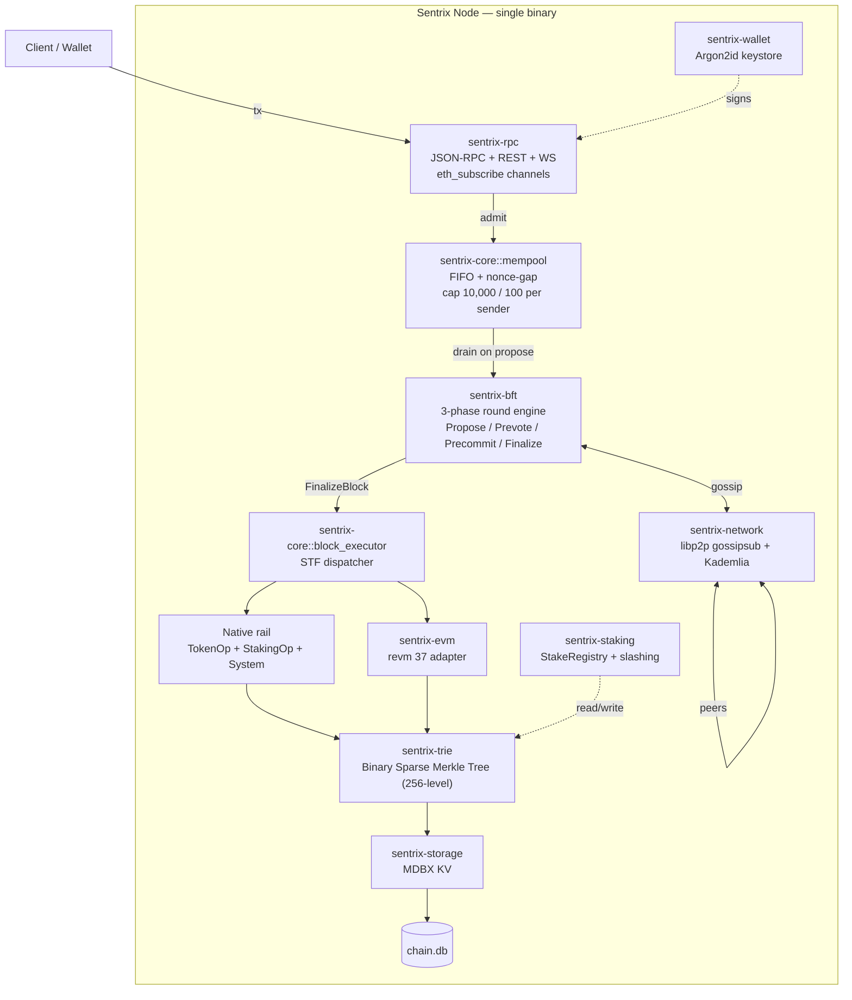
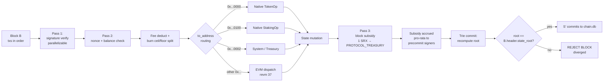

# Sentrix

### A Layer-1 Blockchain — Protocol Specification

**Author:** Satya Kwok &lt;satya@sentrixchain.com&gt;
**Web:** sentrixchain.com
**Version:** 1.3.0 (supersedes 1.2.4)

---

## Abstract

This document specifies *Sentrix*, a Layer-1 blockchain that combines a Tendermint-style Byzantine Fault Tolerant (BFT) consensus protocol with delegated proof-of-stake validator selection, a deterministic dual-rail execution layer (a native protocol-operation rail and an Ethereum Virtual Machine rail running on `revm`), and a binary sparse Merkle tree state commitment. We give a formal systems model, the consensus protocol's message structure and round logic with safety/liveness conditions, the execution pipeline including a forward-looking parallel-execution design, a performance model with closed-form throughput and latency expressions, an adversarial model with quantitative security bounds, and explicit failure-handling protocols for the four classes of fault that the production deployment has encountered. The paper is intended as an engineer-auditable specification rather than a marketing document.

The chain runs in production on chain ID `7119` (mainnet) and `7120` (testnet) under the open-source Rust implementation at `github.com/sentrix-labs/sentrix`. Economic constants — 315M SRX maximum supply, 1 SRX initial block reward halving every 126M blocks, 50% of every transaction fee burned — are codified at the protocol level and are not subject to governance.

---

## 1. Introduction

### 1.1 Scope

This document specifies the Sentrix protocol at a level sufficient for an engineer to (a) implement a conforming node, (b) audit a divergence between two implementations, or (c) reason about chain behaviour under adversarial or partial-failure conditions. It is not an introduction to distributed systems or to blockchain primitives; familiarity with state-machine replication, Byzantine consensus, and the Ethereum execution model is assumed.

Constants, fork heights, slashing parameters, and routing addresses cited throughout this document are pinned to the Rust implementation in the workspace at `github.com/sentrix-labs/sentrix` as of release `v2.1.56`. Where the implementation has parametric values configured at genesis or by environment variable, the document marks the value as *parametric* and points at the relevant module.

### 1.2 Design Goals

The protocol prioritizes, in order:

1. **Deterministic state agreement** — every honest node executing the same blocks against the same prior state produces a bit-identical result.
2. **Single-block finality** — once a block is committed, no fork can replace it without violating the BFT safety threshold.
3. **EVM compatibility** — Solidity contracts and standard Ethereum tooling work without modification.
4. **One-second target block time** — at the BFT round structure described in §4 and under the network assumptions of §2.2.
5. **Operator simplicity** — the chain ships as a single Rust binary; an operator runs one process and manages one local key-value store.
6. **Predictable monetary policy** — supply, halving cadence, fee burn ratio, and genesis allocation are not governable.

### 1.3 Non-Goals

The protocol explicitly does not target:

- **Maximum throughput at any cost.** The throughput bound (§10) trades off against single-block finality and small validator-set requirements.
- **On-chain privacy.** Every transaction, balance, and call is publicly observable. Privacy is delegated to the application layer.
- **Sharding.** State and execution are unsharded. Section 10 derives the consequent scalability bounds.
- **Multi-VM polyglot execution.** The protocol natively supports the EVM and a fixed-ABI native rail; arbitrary VM plug-ins are out of scope.

---

## 2. System Model

### 2.1 Notation

Throughout, we use the following symbols:

| Symbol | Meaning |
|---|---|
| `n` | Number of active validators in the current epoch |
| `f` | Maximum number of Byzantine validators tolerated, `f = ⌊(n − 1) / 3⌋` |
| `Q` | BFT supermajority quorum, `Q = ⌊2n/3⌋ + 1`. For `n = 4`, `Q = 3`. For `n = 21`, `Q = 15`. |
| `S` | Canonical chain state, `S ∈ 𝒮` |
| `S₀` | Genesis state |
| `B` | Block, `B = (header, txs)` |
| `H(B)` | Cryptographic hash of `B`'s canonical encoding |
| `STF` | State transition function, `STF: 𝒮 × ℬ → 𝒮 ∪ {⊥}` |
| `h` | Block height, monotonically increasing |
| `r` | BFT round at a given height, `r ∈ {0, 1, …, MAX_ROUND}` |
| `Δ` | Upper bound on message delay after global stabilisation time (GST) |
| `Vₐ` | Active validator set for the current epoch, `|Vₐ| = n ≤ MAX_ACTIVE_VALIDATORS` |
| `s(v)` | Stake-weight of validator `v ∈ Vₐ` |

`SRX` is the native chain asset; `1 SRX = 10⁸ sentri` (the smallest indivisible unit). All token amounts in this document are expressed in sentri unless explicitly noted otherwise.

### 2.2 Network Model

We assume **partial synchrony** in the sense of Dwork–Lynch–Stockmeyer [15]: there exists an unknown but finite time `GST` (Global Stabilisation Time) after which all messages between honest participants are delivered within bounded delay `Δ`. Before `GST`, messages may be arbitrarily delayed, reordered, or dropped. The protocol must remain *safe* under arbitrary asynchrony and become *live* once partial synchrony holds.

Inter-validator communication is over a libp2p [11] mesh (§7) with three message classes (block gossip, transaction gossip, BFT messages). Messages are authenticated by validator signatures. The protocol does not assume FIFO delivery or reliable transport; the application layer is responsible for retransmission and deduplication.

### 2.3 Adversarial Model

We adopt the standard BFT adversarial model:

- **Honest validators** follow the protocol exactly.
- **Byzantine validators** may deviate arbitrarily — including signing conflicting messages, withholding messages, equivocating on proposals, or coordinating with other Byzantine validators.
- The adversary controls a stake-weighted fraction `β` of the active set, `β ∈ [0, 1]`.

The protocol guarantees safety provided `β < 1/3` (i.e. fewer than `n/3` validators by stake are Byzantine). It guarantees liveness under the additional partial-synchrony assumption (§2.2) when `β < 1/3`.

The adversary is computationally bounded; specifically, the adversary cannot forge ECDSA signatures, find SHA-256 collisions, or break the secp256k1 group's discrete-log assumption.

### 2.4 State Machine Replication

Sentrix is an instance of state machine replication. Each validator maintains an identical replica of `S`. Clients submit transactions; consensus orders them into blocks; every replica applies blocks via `STF` in the same order, deriving the same successor states.

Formally:

> **(SMR Property)** For every honest validator `v` and every height `h`, after `v` has applied all blocks `B₁, …, Bₕ`, the resulting state `Sₕ` is independent of `v`. That is, `∀ v, v′ honest: Sₕ(v) = Sₕ(v′)`.

The SMR property is achieved by (a) the consensus protocol agreeing on a single block per height (§4 safety) and (b) the determinism of `STF` (§5.2).

---

## 3. Architecture

The node is a single Rust binary composed of subsystems sharing the canonical state `S`:



**Figure 1.** System architecture. The block executor receives a `FinalizeBlock` action from the BFT engine after consensus and dispatches each transaction via the routing rules in §5.5. The trie + storage layer is shared across rails; there is no separate execution database.

The 14 crates of the workspace (`crates/sentrix-{primitives,codec,wire,trie,storage,wallet,bft,staking,network,evm,precompiles,core,rpc-types,rpc}`) compile into the single `sentrix` binary in `bin/sentrix`. A separate `bin/sentrix-faucet` exists for testnet operations and is not part of consensus.

---

## 4. Consensus Protocol (Voyager BFT)

Sentrix consensus is a Tendermint-derivative we call *Voyager*. This section specifies the round structure, message types, locking rules, and safety/liveness conditions.

### 4.1 Validator Selection (DPoS)

The active validator set `Vₐ` for an epoch is selected by stake-weighted ranking. Any account that has executed `RegisterValidator` and bonded at least the genesis-configured minimum self-stake is a *candidate*. Token holders may delegate stake to candidates via the `Delegate` operation. The active set for epoch `e + 1` is the top-`MAX_ACTIVE_VALIDATORS = 21` candidates ranked by `total_stake = self_stake + total_delegated`, computed deterministically at the boundary block `h = e × EPOCH_LENGTH` where `EPOCH_LENGTH = 28_800` blocks (~8 hours at 1 s blocks).

Stake withdrawal initiates an *unbonding period* of `UNBONDING_PERIOD = 201_600` blocks, during which the stake remains slashable but does not earn rewards. This prevents a Byzantine validator from offloading slashable stake immediately before equivocating.

`AddSelfStake` (gated by `ADD_SELF_STAKE_HEIGHT`, activated 2026-04-28) lets a registered validator increase its self-stake from its own wallet without re-registering, used during unjail flows and stake top-ups.

### 4.2 Round Structure

A *height* `h` is finalized through one or more *rounds* `r ∈ {0, 1, …, MAX_ROUND}` where `MAX_ROUND = 100`. Each round consists of three phases — `PROPOSE`, `PREVOTE`, `PRECOMMIT` — followed by a `FINALIZE` phase if quorum is reached. The four phases are encoded in `BftPhase = {Propose, Prevote, Precommit, Finalize}`.

For round `(h, r)`, the *proposer* is chosen by

$$
\text{propose}(h, r) = V_a[(h + r) \bmod n]
$$

Round-robin over the active set; stake-weight does not affect proposer selection within an epoch (the function name `weighted_proposer` in `crates/sentrix-staking/src/staking.rs` is historical).

Three message types circulate:

| Type | Carried fields | Role |
|---|---|---|
| `Proposal(h, r, B)` | `height, round, block_hash, sig` | Proposer's claim that `B` is the next block at `(h, r)` |
| `Prevote(h, r, x)` | `height, round, x ∈ {block_hash, ⊥}, sig` | Validator's vote |
| `Precommit(h, r, x)` | `height, round, x ∈ {block_hash, ⊥}, sig` | Validator's commitment |

A signature is a 65-byte secp256k1 ECDSA recoverable signature (64-byte compact `(r, s)` plus one byte `recovery_id`), computed over the SHA-256 of a canonical signing payload that includes a domain-separation prefix (`0x01` proposal, `0x02` prevote, `0x03` precommit). The proposer's signature on a `Proposal` also covers `B`'s contents. Wire-level messages are wrapped in `BftMessage = {Propose(Proposal), Prevote(Prevote), Precommit(Precommit), RoundStatus(RoundStatus)}` for transport.

#### 4.2.1 PROPOSE

The proposer for `(h, r)` constructs a candidate block `B`:

```
B = {
    header: {
        index: h,
        previous_hash: H(B_{h-1}),
        timestamp: now(),
        proposer: addr(propose(h, r)),
        state_root: STF(S_{h-1}, B).root,    // STAGED — see §5
        justification: J_{h-1},               // precommits proving B_{h-1} finalized
        merkle_root: tx_merkle(B.txs),
    },
    txs: drain_mempool(MAX_TX_PER_BLOCK = 5_000)
}
```

The proposer broadcasts `Proposal(h, r, B)` to all of `Vₐ`. Honest validators wait at most `propose_timeout(r) = min(20_000 + r × 1_000, 30_000) ms` for the proposal; on timeout they treat the proposal as `⊥` and proceed to `PREVOTE`.

These timeouts are upper bounds, not phase durations. In the happy path on a low-latency mesh, all three phases complete in well under one second; the chain produces blocks at the `BLOCK_TIME_SECS = 1` target. The wide timeouts exist to absorb peer-mesh repair after transient disconnects (see `crates/sentrix-bft/src/engine/timeouts.rs` for the incident history).

#### 4.2.2 PREVOTE

Each validator `v ∈ Vₐ` evaluates the proposal:

- If `B` validates (signature, parent hash, transaction signatures, state root) and `v` is not locked on a different block at this height, `v` broadcasts `Prevote(h, r, H(B))`.
- Otherwise, `v` broadcasts `Prevote(h, r, ⊥)`.

The validator then waits for prevotes from validators carrying total stake ≥ `Q`. If `Q` validators by stake-weight prevote the same `H(B)` (a *polka*), `v` proceeds to `PRECOMMIT` with `H(B)`. Otherwise `v` proceeds with `⊥`.

Timeout: `prevote_timeout(r) = min(12_000 + r × 2_000, 30_000) ms`.

#### 4.2.3 PRECOMMIT

Each validator broadcasts `Precommit(h, r, x)`:

- `x = H(B)` if `v` saw a polka for `H(B)` in the prevote phase.
- `x = ⊥` otherwise.

A validator waits for precommits carrying total stake ≥ `Q`. If `Q` precommits agree on `H(B)`, `B` is *finalized* at height `h`.

Timeout: `precommit_timeout(r) = min(12_000 + r × 2_000, 30_000) ms`.

#### 4.2.4 FINALIZE

The set of `Q` precommits constitutes the *justification* `Jₕ` for block `B`. `Jₕ` is included in the next block's header (`B_{h+1}.header.justification`), providing public proof of finalization.

Each validator applies `B` to its local state via `STF` (§5) and advances to round `0` of height `h + 1`.

### 4.3 Locking

Once a validator has prevoted a block in round `r`, it locks on that block and round (`locked_block` and `locked_round` are persisted in `BftRoundState`). In subsequent rounds at the same height, it will only prevote a different block if it observes a polka (≥ `Q` prevotes for the same alternative) at a *higher* round. This rule is what guarantees safety:

> **(Locking Invariant)** An honest validator that precommits `H(B)` in round `r` only precommits a different block `H(B′)` in round `r′ > r` if `≥ Q` prevotes for `H(B′)` are observed at some round `r′′` with `r ≤ r′′ < r′`.

Since `≥ Q` honest validators must have abandoned their lock on `H(B)` to prevote `H(B′)`, and abandoning a lock requires observing the alternative polka, no honest validator precommits both `H(B)` and `H(B′)`.

### 4.4 Round Skip

If a round fails to finalize within its phase timeouts plus `ε`, the round terminates and round `r + 1` begins. The proposer rotates to `Vₐ[(h + r + 1) mod n]`.

Round advancement is **timeout-only** (per `2026-04-17` fix, see `crates/sentrix-bft/src/lib.rs` doc): no vote-triggered or `RoundStatus`-triggered catch-up promotes a validator across rounds. This avoids the *validator-leapfrog* stall in which validators clear collected votes on every round jump.

Per-phase timeouts grow linearly with round number to absorb sustained partial synchrony:

```
propose_timeout(r)   = min(20_000 + r × 1_000, 30_000) ms
prevote_timeout(r)   = min(12_000 + r × 2_000, 30_000) ms
precommit_timeout(r) = min(12_000 + r × 2_000, 30_000) ms
```

Once any phase timeout reaches the cap of 30 s, it does not grow further. After `MAX_ROUND = 100` consecutive failed rounds at a single height, the chain is considered stalled at that height; recovery requires operator intervention (§11.1).

### 4.5 Consensus Sequence

```mermaid
sequenceDiagram
    autonumber
    participant P as Proposer (h,r)
    participant V1 as Validator v₁
    participant V2 as Validator v₂
    participant Vn as Validator v_n
    Note over P,Vn: PROPOSE (timeout 20s + r×1s, capped 30s)
    P->>V1: Proposal(h, r, B)
    P->>V2: Proposal(h, r, B)
    P->>Vn: Proposal(h, r, B)
    Note over P,Vn: PREVOTE (timeout 12s + r×2s, capped 30s)
    V1-->>P: Prevote(h, r, H(B))
    V1-->>V2: Prevote(h, r, H(B))
    V2-->>V1: Prevote(h, r, H(B))
    V2-->>Vn: Prevote(h, r, H(B))
    Vn-->>P: Prevote(h, r, H(B))
    Note over P,Vn: ≥Q stake-weighted prevotes → polka
    Note over P,Vn: PRECOMMIT (timeout 12s + r×2s, capped 30s)
    V1-->>P: Precommit(h, r, H(B))
    V2-->>P: Precommit(h, r, H(B))
    Vn-->>P: Precommit(h, r, H(B))
    Note over P,Vn: ≥Q stake-weighted precommits → FINALIZE
    Note over P,Vn: B finalized; J_h = {Precommits}
    Note over P,Vn: Apply STF; advance to (h+1, 0)
```

**Figure 2.** Voyager BFT round in the happy path. The labelled timeouts are upper bounds on each phase; on a healthy mesh the round completes in much less time, and the chain produces blocks at the 1 s target.

### 4.6 Safety

**Theorem 1 (Agreement).** *For all heights `h`, no two honest validators finalize different blocks at height `h`, provided `β < 1/3` of stake is Byzantine.*

**Proof sketch.** Suppose honest validators `v₁` and `v₂` finalize `B` and `B′` at height `h` with `H(B) ≠ H(B′)`. Each saw `Q` precommits for their respective blocks. With `Q = ⌊2n/3⌋ + 1` and `f = ⌊(n − 1)/3⌋`, we have `2Q − n ≥ f + 1`, so the two precommit sets share at least `f + 1` validators. Among these shared validators at least one is honest (since at most `f` are Byzantine). An honest validator that precommits `H(B)` cannot precommit `H(B′)` without an intervening polka for `H(B′)` (Locking Invariant, §4.3). For the polka to occur, validators carrying total stake `≥ Q` must have prevoted `H(B′)`, which requires at least `Q − f > f` honest validators to have abandoned their lock on `H(B)` — contradicting the Locking Invariant for those validators. ∎

**Theorem 2 (Validity).** *Every finalized block is well-formed: its header validates, all transaction signatures verify, the state root matches `STF` execution, and its justification is a valid `Q`-precommit set on its parent.*

**Proof.** Honest validators only prevote a well-formed block (§4.2.2). For finalization, `Q ≥ n − f` validators precommit, of which at least `Q − f ≥ n − 2f > f` are honest. Honest precommits require honest prevotes, and honest prevotes require valid blocks. ∎

### 4.7 Liveness

**Theorem 3 (Termination).** *Under partial synchrony (§2.2) and `β < 1/3`, every height eventually finalizes within `MAX_ROUND` rounds.*

**Proof sketch.** After `GST`, all messages between honest validators deliver within `Δ`. The round-skip mechanism (§4.4) eventually selects a timeout greater than `Δ` (capped at 30 s, sufficient for any reasonable `Δ` in production network conditions). Within such a round, an honest proposer's `Proposal` reaches all honest validators in time, all honest prevotes reach all honest validators in time (yielding a polka of stake `≥ n − f ≥ Q`), and similarly for precommits. The block finalizes. Round-robin proposer selection (§4.2) guarantees an honest proposer is selected in at most `f + 1` consecutive rounds, well within `MAX_ROUND = 100`. ∎

### 4.8 Message Complexity

Per round, each validator broadcasts one `Prevote` and one `Precommit`. The proposer additionally broadcasts one `Proposal`. With `n` validators, the per-round originating messages are exactly `2n + 1` (one proposal, `n` prevotes, `n` precommits). Under all-to-all delivery via gossipsub mesh, total bytes transferred scale as `O(n²)` worst case; with optimal gossip the total amortizes to `O(n log n)`.

For `n = 4` (current mainnet, `Q = 3`), per-round messages are `2 × 4 + 1 = 9`. For the maximum active-set size `n = 21` (`Q = 15`), per-round messages are `2 × 21 + 1 = 43`. Both regimes are well within libp2p's gossip throughput envelope.

### 4.9 BFT Gate Relax

Pre-fork, the protocol requires the entire active set online (`active = n`) to make consensus progress. Post `BFT_GATE_RELAX_HEIGHT`, the requirement relaxes to `active ≥ ⌈2n/3⌉`, providing a one-jail tolerance margin for `n = 4` (allowing the chain to advance with three of four signers when one is jailed). The gate is operator-controlled via the `BFT_GATE_RELAX_HEIGHT` environment variable; default is `u64::MAX` (disabled).

---

## 5. Execution Layer

The execution layer implements `STF: 𝒮 × ℬ → 𝒮 ∪ {⊥}`. It dispatches transactions to one of two rails — *native* or *EVM* — based on the transaction's `to_address`, applies side effects to the canonical state, and computes the resulting state root.

### 5.1 Pipeline



**Figure 3.** Execution pipeline. Each transaction passes through signature verification, fee handling, rail dispatch, and state mutation. The block subsidy is applied once per block at the end; the state trie is recomputed, and the resulting root is checked against the proposer's claim. Pass 1 (signature verification) is independently parallelizable per transaction; Pass 2 onwards is strictly sequential by `B.txs` order (§5.2).

### 5.2 Determinism Axioms

For `STF` to satisfy the SMR Property (§2.4), every implementation must be deterministic in three senses:

**(D1) Operation order.** Transactions are applied in `B.txs` order. No reordering, no parallel-execution-with-merge that produces a different commit order.

**(D2) State read consistency.** A transaction's state reads at its execution point reflect all prior transactions in the same block. No snapshot isolation, no read-after-write divergence.

**(D3) Floating-point freedom.** No state mutation depends on IEEE-754 arithmetic. All calculations are integer or fixed-point. Sentrix uses `u64` sentri throughout; SRX-denominated computations are integer multiples or quotients (e.g. `total_fee.div_ceil(2)` for the burn share, §8.3).

These axioms hold for the current sequential implementation. They are also the constraints any future parallel-execution scheme (§5.6) must satisfy: a parallel execution is valid if and only if it produces a state indistinguishable from the sequential execution defined by `B.txs` order.

### 5.3 State Transition Function

```
STF(S, B):
  // Pass 0: header validation
  1.  verify B.header.previous_hash == H(B_{h-1})
  2.  verify B.header.proposer == propose(B.header.index, r)
                                  for some round r ≤ MAX_ROUND
                                  (round determined by justification)
  3.  verify B.header.justification is a valid Q-precommit set on B_{h-1}
  4.  S' ← S

  // Pass 1: transaction signature verification (parallelizable)
  5.  for each tx in B.txs:
      a. verify ECDSA(tx.signature, canonical_signing_payload(tx),
                       tx.public_key)
      b. verify keccak256(tx.public_key)[12:] == tx.from_address

  // Pass 2: sequential apply (D1)
  6.  for each tx in B.txs (in order):
      a. if S'[tx.from].nonce ≠ tx.nonce: skip
      b. if tx.fee < MIN_TX_FEE: skip
      c. if S'[tx.from].balance < tx.fee + tx.amount: skip
      d. S'[tx.from].balance -= tx.fee
      e. // burn share is debited but never credited;
         // total_burned is tracked in chain accounting
         total_burned_srx += tx.fee.div_ceil(2)
      f. dispatch tx based on tx.to_address (Table 5.5):
         - TOKEN_OP_ADDRESS  (0x...0000) → native TokenOp
         - STAKING_ADDRESS   (0x...0100) → native StakingOp
         - PROTOCOL_TREASURY (0x...0002) → system/claim path
         - any other         → EVM dispatch via revm
      g. if dispatch fails:
           - revert state changes for this tx (step f side-effects)
           - keep fee deduction (step d) and burn debit (step e)
      h. S'[tx.from].nonce += 1

  // Pass 3: validator fee credit (per block, not per tx)
  7.  let total_fee = Σ tx.fee for tx in B.txs (admissible)
  8.  let validator_share = total_fee - total_fee.div_ceil(2)
                          // = floor(total_fee / 2)
  9.  S'[B.header.proposer].balance += validator_share

  // Pass 4: block subsidy
  10. let subsidy = block_reward(B.header.index)
                  = max(BLOCK_REWARD ÷ 2^era, 0) where
                    era = ⌊B.header.index / HALVING_INTERVAL_V2⌋
  11. S'[PROTOCOL_TREASURY].balance += subsidy
  12. for each precommitter v in B_{h-1}.justification.precommits:
        S'.staking.pending_rewards[v] += subsidy × s(v) / Σ s(precommitters)
                                         × (1 − commission(v) for delegators)

  // Pass 5: trie commit
  13. recompute root R from S' (binary sparse Merkle, depth 256)
  14. if h ≥ STATE_ROOT_FORK_HEIGHT and R ≠ B.header.state_root:
        return ⊥
  15. return S'
```

`STF` is deterministic by D1–D3 (§5.2), so any honest validator computes the same `S'` from the same `(S, B)`. A divergence in step 14 indicates either (a) a Byzantine proposer who proposed a block whose claimed state root does not match correct execution, or (b) a bug in the local executor.

The state-root check is gated by `STATE_ROOT_FORK_HEIGHT = 100_000`. Pre-fork blocks are not committed to a state root in their header; the chain's bytewise determinism is the only consensus binding for those blocks. Post-fork, the state root is part of the block hash and any divergence aborts apply.

### 5.4 Native Rail

The native rail dispatches three operation classes based on `to_address`:

**TokenOp** (`TOKEN_OP_ADDRESS = 0x00…0000`)
Encoded as canonical JSON `{"op": "...", ...}` in `tx.data`. Variants: `Deploy`, `Transfer`, `Burn`, `Mint`, `Approve` (SRC-20 fungibles). Variants `DeployNft`, `MintNft`, `TransferNft`, `BurnNft`, `Deploy1155`, `Mint1155`, `Transfer1155`, `Burn1155` (SRC-721 / SRC-1155 NFTs) are wire-format-stable but dispatch is gated by `NFT_TOKENOP_HEIGHT = u64::MAX` (disabled) pending Pass-2 storage layer.

**StakingOp** (`STAKING_ADDRESS = 0x00…0100`)
Encoded as canonical JSON. Variants: `RegisterValidator`, `Delegate`, `Undelegate`, `Redelegate`, `ClaimRewards`, `Unjail`, `AddSelfStake`, `SubmitEvidence`, `JailEvidenceBundle`. The last is gated by `JAIL_CONSENSUS_HEIGHT = u64::MAX` (consensus-computed jail dispatch deferred pending non-determinism root cause fix).

**System** (`PROTOCOL_TREASURY = 0x00…0002`)
Treasury operations (reward escrow drain), implemented inside the executor rather than as a user-facing op enum.

The native rail bypasses revm entirely. Native ops cost `MIN_TX_FEE = 10_000 sentri` flat, regardless of operation. Native operations interoperate with the EVM rail through the canonical state: an EVM contract may read native SRC-20 balances through a precompile; native staking state is similarly readable.

### 5.5 EVM Rail

For any other `to_address`, the dispatcher invokes `revm 37` via the `sentrix-evm` adapter with a state provider backed by the chain trie. Standard EVM semantics apply: gas accounting follows EIP-1559 [13] (per-block `baseFeePerGas` plus sender-set tip), opcode behaviour matches Ethereum mainnet with the exception of chain ID (`7119` mainnet, `7120` testnet). Standard tooling (Foundry, Hardhat, MetaMask, ethers, viem) interoperates without modification.

EVM-side `eth_sendRawTransaction` enters a translation layer that wraps the EIP-155 RLP-encoded transaction into the canonical Sentrix transaction form (§5.7) before mempool admission. EIP-155 signature verification happens before translation; gossip and finalization are identical from there on.

EVM value transfers (a non-zero `tx.value` accompanying a contract call) are gated by `EVM_VALUE_TRANSFER_HEIGHT = u64::MAX` (disabled) pending the eager-write divergence investigation that motivated the v2.1.50 fork-gate. Operators flip the gate via the `EVM_VALUE_TRANSFER_HEIGHT` environment variable when Pass-2 EVM apply is verified consistent across the cluster.

Routing is summarized in:

| `to_address` sentinel | Constant name | Rail / Class |
|---|---|---|
| `0x0000000000000000000000000000000000000000` | `TOKEN_OP_ADDRESS` | Native TokenOp |
| `0x0000000000000000000000000000000000000100` | `STAKING_ADDRESS` | Native StakingOp |
| `0x0000000000000000000000000000000000000002` | `PROTOCOL_TREASURY` | System / Treasury |
| anything else | — | EVM via revm |

### 5.6 Forward-Looking Parallel Execution

Execution within a block is currently strictly sequential (D1, §5.2). The throughput ceiling imposed by the protocol is

```
TPS_max = MAX_TX_PER_BLOCK / BLOCK_TIME_SECS = 5_000 / 1 = 5_000 tx/s
```

The achievable rate on any specific deployment is bounded by single-threaded apply throughput (signature verification, nonce/balance checks, dispatch, trie writes). Beyond the regime where sequential apply saturates one CPU core, parallel execution becomes necessary.

The forward-looking parallel-execution model adopts an *optimistic concurrency control* scheme inspired by Block-STM [16] and Monad's pipelined execution model [18]:

1. **Static dependency hints.** Each transaction declares (or the dispatcher infers) a *read-set* and *write-set*. For native ops the sets are derived from operation arguments (e.g. `Delegate.validator` is the only stake-registry write). For EVM dispatch the sets are over-approximated from prior-block traces.
2. **Independent-batch identification.** Build a directed dependency graph `G = (V, E)` where `tx_i → tx_j` iff `tx_j`'s read-set intersects `tx_i`'s write-set and `j > i` in block order. Compute root nodes of `G`; these execute in parallel. After each batch commits, update `G` and identify the next layer.
3. **Optimistic re-execution.** Transactions whose dependencies are over-approximated execute speculatively; on a write-conflict, abort and re-execute the conflicting transaction sequentially.
4. **Sequential commit.** Apply each transaction's writes to canonical state in `B.txs` order regardless of execution order. This preserves D1 — the *commit* schedule equals the block order.

The required protocol changes are: (a) declared read/write sets in transaction metadata, (b) a speculative-execution-friendly state provider, (c) a deterministic conflict-resolution rule. Implementation is sequenced after the chain reaches a stable single-implementation baseline; current production runs the sequential apply path, and no consensus-layer changes are required to enable parallel execution later.

### 5.7 Transaction Format

A transaction is the unit of state change. Its canonical wire format is (`crates/sentrix-primitives/src/transaction.rs`):

```rust
pub struct Transaction {
    pub txid:         String,      // hex-encoded SHA-256 of canonical signing payload
    pub from_address: String,      // hex-encoded 20-byte address (ECDSA-recovered)
    pub to_address:   String,      // hex-encoded 20-byte address (routing key, §5.5)
    pub amount:       u64,         // sentri (1 SRX = 10⁸ sentri)
    pub fee:          u64,         // sentri, ≥ MIN_TX_FEE = 10_000
    pub nonce:        u64,         // sender account sequence
    pub data:         String,      // empty for plain transfers;
                                   // canonical JSON for native ops;
                                   // EVM call payload for EVM dispatch
    pub timestamp:    u64,         // unix seconds (anti-replay window)
    pub chain_id:     u64,         // 7119 mainnet, 7120 testnet
    pub signature:    String,      // hex secp256k1 ECDSA, 65 bytes (r, s, v)
    pub public_key:   String,      // hex secp256k1 uncompressed, 65 bytes
}
```

Maximum transaction size is `MAX_TX_SIZE = 128 KB`. The mempool admits at most `MAX_MEMPOOL_SIZE = 10_000` transactions globally, with `MAX_MEMPOOL_PER_SENDER = 100` per-sender; transactions older than `MEMPOOL_MAX_AGE_SECS = 3_600` are evicted.

The signed payload is the canonical JSON serialization of the eight content fields (`amount`, `chain_id`, `data`, `fee`, `from`, `nonce`, `timestamp`, `to`) in lexicographic key order. The payload is hashed with SHA-256; the resulting 32-byte digest is signed with secp256k1 ECDSA.

EVM-side `eth_sendRawTransaction` enters the translation layer described in §5.5; native-side wallets that sign the canonical Sentrix payload directly (e.g. `solux.sentriscloud.com`) submit to the `sentrix_sendTransaction` endpoint.

---

## 6. State Layer

### 6.1 Trie Commitment

Canonical state is committed via a *binary sparse Merkle tree* with depth 256 [9] (`crates/sentrix-trie`). Each leaf is keyed by a 256-bit hash of the account address and storage slot. The root hash `R(S)` is included in the block header as `B.header.state_root`.

For account `a`, the proof of inclusion is `O(log₂ N)` where `N` is the number of populated leaves. Light clients verify any fact about `S` against `R(S)` with a logarithmic-size Merkle path.

The state root commitment is gated by `STATE_ROOT_FORK_HEIGHT = 100_000` (§5.3). Below this height the chain advanced by bytewise consensus only; above it the state root is part of the block hash and any divergence aborts apply.

### 6.2 State Persistence

State is persisted in MDBX [10] (`crates/sentrix-storage`), a memory-mapped key-value store. Read amplification is bounded; write amplification is constant-time per leaf update. State size grows with the number of unique accounts, contract storage slots, and historical block records.

A node maintains exactly one `chain.db` file. Recovery from corruption (e.g. `MDBX_MAP_FULL` from disk pressure, or page-layout divergence after a forensic backup operation) is performed by acquiring a canonical `chain.db` copy from a healthy peer via byte-level transfer; this is operationally documented (§11.4) and produces bit-identical state regardless of the receiving node's prior state.

### 6.3 Light Clients

A light client tracks block headers but no full state. To verify a fact `f` (e.g. account balance at height `h`):

1. Acquire `B_h.header.state_root` through the BFT justification chain or a trusted weak-subjectivity checkpoint.
2. Request a Merkle proof from any full node for the leaf encoding `f` against root `R = B_h.header.state_root`.
3. Verify the proof locally; reject if the recomputed root does not match.

This makes constrained-environment usage (mobile, browser) feasible without trusting any specific full node. A formal weak-subjectivity protocol — including checkpoint distribution, refresh cadence, and validator-set-rotation tracking — is open work (§14).

---

## 7. Network Layer

### 7.1 Topology

Validators and full nodes form a libp2p mesh (`crates/sentrix-network`). Peer discovery uses Kademlia DHT [12] with seed peer addresses for bootstrap. Each validator publishes a *validator advertisement* record containing its current libp2p multiaddrs; advertisements are gossiped on a dedicated topic and persisted in the DHT, enabling validators to maintain direct routes for BFT messages without external coordination.

### 7.2 Gossip Topics

| Topic | Payload | Audience |
|---|---|---|
| `sentrix/blocks/1` | Finalized blocks | All nodes; receivers validate and apply via `STF` |
| `sentrix/txs/1` | User transactions | All nodes; forwarded until included in a proposed block |
| `sentrix/bft/1` | Proposals, prevotes, precommits | Validators only; full nodes ignore |
| `sentrix/validator-adverts/1` | Validator advertisements | Validators; used to maintain direct routes |

### 7.3 Bootstrap Sequence

```
1. Connect to seed peers (configured at startup).
2. Run Kademlia DHT walk to populate the peer routing table.
3. Request the chain head from peers; identify the head with the
   longest stake-weighted justification chain.
4. Sync block-by-block from a peer until the local height matches
   the network head.
5. Subscribe to gossip topics; if a validator, begin participating
   in BFT for the next round.
```

A node behind the chain tip applies blocks linearly. A node ahead of the tip cannot exist except through Byzantine equivocation; equivocation evidence is itself a slashable offence (§9.1).

### 7.4 Transport

Cross-validator transport runs over public IPv4 with TLS-protected libp2p Noise; an earlier WireGuard mesh deployment was retired 2026-04-30 in favour of public-IP transport. Validator hosts open one inbound TCP port for libp2p (default 30303). RPC and WebSocket endpoints are exposed via separate HTTP processes fronted by an edge reverse proxy.

---

## 8. Tokenomics

### 8.1 Supply

The maximum supply is `MAX_SUPPLY_V2 = 315,000,000 SRX = 3.15 × 10¹⁶ sentri`, enforced post `TOKENOMICS_V2_HEIGHT`. Pre-fork the cap was `MAX_SUPPLY_V1 = 210M SRX`; the fork lifted the cap and altered halving cadence. There is no mechanism (governance, hard fork, or otherwise) by which the post-fork cap changes.

### 8.2 Block Reward and Halving

The base block reward is `BLOCK_REWARD = 1 SRX = 100_000_000 sentri`. The reward halves every `HALVING_INTERVAL_V2 = 126_000_000` blocks (~4 years at 1 s blocks, modeled on Bitcoin's halving cadence). Pre-fork the interval was `HALVING_INTERVAL_V1 = 42_000_000` blocks (~1.33 years). Formally:

```
era(h)         = ⌊h / HALVING_INTERVAL_V2⌋  for h ≥ TOKENOMICS_V2_HEIGHT
block_reward(h) = BLOCK_REWARD × 2^{−era(h)}
```

The disinflationary supply curve converges asymptotically to the cap; combined with the 63M premine (§8.4), maximum supply approaches 315M over a multi-decade horizon.

### 8.3 Fee Mechanism

Every transaction pays a fee. The fee model differs by rail:

- **Native rail:** `fee = MIN_TX_FEE = 10_000 sentri = 10⁻⁴ SRX` flat, regardless of operation.
- **EVM rail:** `fee = gas_used × (base_fee + tip)` per EIP-1559. `base_fee` adjusts each block to maintain target gas usage; `tip` is sender-set.

Fee disposition (per block, computed over `total_fee = Σ tx.fee` across admissible transactions):

```
burn_share      = total_fee.div_ceil(2)        // ceiling division
validator_share = total_fee − burn_share       // floor(total_fee / 2)
```

The burn share is *debited from senders but never credited anywhere*; it leaves the supply entirely. The chain's `total_burned_srx` accounting tracks the cumulative burn for telemetry (`/chain/info`). The validator share is credited directly to the proposer's balance (`coinbase_validator`), immediately spendable. For odd-valued fees the burn receives the extra sentri (ceiling) — this preserves a clean integer split across all fees with no rounding loss.

Block subsidy is *not* paid as a fee; it follows a separate path (§8.5) so issuance enters circulation only when claimed.

### 8.4 Premine

A premine of `63M SRX = 20% of MAX_SUPPLY_V2` was allocated at genesis across four accounts. Allocations are public and verifiable on-chain:

| Role | Amount | Address |
|---|---|---|
| Founder | 21M SRX | `0x5b5b06688dcdbe532353ac610aaff41af825279d` |
| Early Validator | 10.5M SRX | `0x328d56b8174697ef6c9e40e19b7663797e16fa47` |
| Ecosystem Fund | 21M SRX | `0xeb70fdefd00fdb768dec06c478f450c351499f14` |
| Reserve | 10.5M SRX | `0x2578cad17e3e56c2970a5b5eab45952439f5ba97` |

The remaining 80% (252M SRX) issues via block reward over the halving curve. Operational sub-allocation policies (grant programs, listings, vesting commitments) are outside this specification; refer to the public tokenomics document at `sentrixchain.com/docs/tokenomics`.

### 8.5 Reward Routing

Block subsidy is *not* paid directly to the proposer. It is minted into a system address `PROTOCOL_TREASURY = 0x00…0002` at the end of each block (gated by `VOYAGER_REWARD_V2_HEIGHT`), then accrued pro-rata to the *precommitters* of the parent block:

```
for v in B_{h-1}.justification.precommits:
    pending_rewards[v] += subsidy × s(v) / Σ s(precommitters)
```

A delegator inherits its validator's accrual minus the validator's published commission rate. Validators and delegators drain `pending_rewards` into spendable balance via an explicit `ClaimRewards` staking operation.

This separation has two consequences:

1. **Supply invariance.** New SRX enters circulation only when claimed, providing a clean accounting boundary between issuance and distribution. Circulating supply at height `h` is `total_minted(h) − total_burned(h) − Σ pending_rewards`.
2. **Proposer revenue isolation.** The proposer's fee share is real-time spendable, decoupling propose-incentive from sign-incentive.

---

## 9. Validator Economics & Slashing

### 9.1 Slashing Conditions

| Trigger | Evidence | Slash | Jail |
|---|---|---|---|
| Equivocation (double-sign) | Two signed votes (prevote or precommit) on conflicting blocks at the same `(h, r)` | `DOUBLE_SIGN_SLASH_BP = 2_000` (20% of self-stake) | Permanent (tombstone) |
| Downtime | Signed `< MIN_SIGNED_PER_WINDOW = 4_320` blocks within a trailing `LIVENESS_WINDOW = 14_400` blocks (~4 hours at 1 s) | `DOWNTIME_SLASH_BP = 10` (0.1%) | `DOWNTIME_JAIL_BLOCKS = 600` blocks (~10 min) |

Slashed SRX is destroyed (debited from the validator's stake but not credited anywhere — same mechanism as fee burn, §8.3). This preserves the supply invariant and avoids the perverse incentive of validators benefiting from peer slashing.

The downtime threshold is permissive intentionally — `4_320 / 14_400 = 30%` signed minimum — so legitimate causes (kernel reboot, brief network disruption) do not jail. Repeat offenders accumulate jailings; their unbonded stake decays over time.

The consensus-computed jail dispatch (`StakingOp::JailEvidenceBundle`) is gated by `JAIL_CONSENSUS_HEIGHT = u64::MAX` (disabled). Manual jailing — operator submits a `Jail` admin operation against a divergent or misbehaving validator — remains the operational path until the consensus dispatch is verified deterministic across the cluster.

### 9.2 Validator Revenue

For a validator with stake fraction `f = s(v) / Σ s(Vₐ)` and commission rate `c`:

```
expected_revenue_per_epoch ≈ EPOCH_LENGTH × subsidy × f
                             × (1 − fraction_delegated × (1 − c))
                          + 0.5 × f × epoch_fees
```

The first term (signing revenue) accrues into `pending_rewards` and is escrowed until the validator and its delegators claim. The second term (proposing revenue) credits to the proposer's spendable balance directly each block. Under round-robin proposer selection (§4.2), each active validator proposes exactly `1/n` of blocks in expectation per epoch.

### 9.3 Liveness Penalty

A validator that signs fewer than `MIN_SIGNED_PER_WINDOW` blocks within the trailing `LIVENESS_WINDOW` is jailed: removed from the active set and slashed `DOWNTIME_SLASH_BP / 10000` of self-stake. Re-entry requires an explicit `Unjail` transaction after `DOWNTIME_JAIL_BLOCKS`. If slashing dropped self-stake below the genesis-configured minimum, `AddSelfStake` (§4.1) is required before re-entry.

---

## 10. Performance Model

### 10.1 Throughput

Per-block transaction capacity is bounded by `MAX_TX_PER_BLOCK = 5_000`. With block time `BLOCK_TIME_SECS = 1`, the protocol-imposed throughput ceiling is

```
TPS_max = MAX_TX_PER_BLOCK / BLOCK_TIME_SECS = 5_000 tx/s
```

The achievable throughput in any specific deployment is bounded below this by:

```
TPS_actual = min(TPS_max, TPS_exec, TPS_net)
```

where:

- `TPS_exec` is the rate at which a single validator can verify, dispatch, and apply transactions sequentially (D1, §5.2). Sequential apply is the binding constraint; the rate depends on the transaction mix (native ops are cheaper than EVM calls; EVM cost scales with opcode complexity), the validator's CPU, and trie I/O latency. No public benchmark numbers are codified in this document; the prototype benchmark framework (§12) is the path to producing them.
- `TPS_net` is the rate at which gossipsub can propagate the proposal and votes within `BLOCK_TIME_SECS`. It is bounded by `bandwidth × BLOCK_TIME / |B|`. For `MAX_TX_PER_BLOCK = 5_000` at typical transaction sizes, this is well within standard deployment bandwidth.

For target operating regions (`n = 4` to `n = 21`), `TPS_exec` is the binding constraint. Future parallel execution (§5.6) is the path to relaxing it.

### 10.2 Latency

Per-block latency in the happy path decomposes into:

```
T_block = T_propose + T_prevote + T_precommit + T_apply
```

Each of the first three terms is *bounded above* by its phase timeout (§4.2) — `propose_timeout(0) = 20_000 ms`, `prevote_timeout(0) = 12_000 ms`, `precommit_timeout(0) = 12_000 ms` — but in normal operation completes far below the timeout. Empirically, on a healthy mesh, the chain produces blocks at the 1 s target, implying typical phase durations on the order of tens to low-hundreds of milliseconds. `T_apply` is the time to verify signatures, dispatch transactions, mutate state, and commit the trie root.

End-to-end latency observed by a transaction submitter is

```
T_user = T_mempool + T_block_inclusion + T_finalization
       ≤ 1 round   + 1 block            + 1 block
```

where `T_mempool` is the time until a proposer drains the transaction. Under non-adversarial conditions the proposer sees the transaction before composing the next block, and `T_user` is dominated by `T_block`.

Round-skip extends end-to-end latency proportionally. After `r` failed rounds at a single height, the cumulative wall-clock cost is bounded by `Σ (propose_timeout(i) + prevote_timeout(i) + precommit_timeout(i))` for `i ∈ [0, r]`, which saturates at `3 × 30_000 ms = 90 s` per round once timeouts hit the cap.

### 10.3 Message Complexity

Per round, `2n + 1` consensus messages are originated (one proposal, `n` prevotes, `n` precommits). Total bytes transferred across the mesh scale as `O(n²)` worst case for naive all-to-all delivery; with optimal gossipsub mesh `O(n log n)`.

| `n` | Originating messages per round | Worst-case mesh transfer |
|---|---|---|
| 4 | 9 | `O(16)` |
| 21 | 43 | `O(441)` |
| 100 | 201 | `O(10⁴)` |

For target operating regions (`n ≤ 21`), per-round message volume is small and well within libp2p's gossip throughput envelope.

### 10.4 Scalability Bounds

The single-shard architecture imposes:

- **State growth** is linear in unique accounts and contract storage slots. The trie's `O(log N)` proof size and `O(log N)` update cost mean state size growth is the limiting factor for long-horizon node disk requirements.
- **Bandwidth per validator** is `O(n × |B|)` per block due to gossip fan-out.
- **Compute per block** is `O(|B|)` sequential apply; future parallel apply (§5.6) reduces this to `O(|B| / p)` for `p`-way parallelism.
- **Validator-set size** is capped at `MAX_ACTIVE_VALIDATORS = 21` by the staking module. Beyond this, the active set rotates by stake ranking; candidates outside the top 21 do not participate in consensus.

These bounds frame the protocol's operating envelope: Sentrix is sized for retail-grade settlement at validator counts in the low tens, not for thousand-validator general-purpose computation. Sharding and L2 rollups are out of scope for the current specification.

---

## 11. Failure Handling

This section specifies behaviour under four failure classes that the production deployment has encountered.

### 11.1 Network Partition

**Scenario.** The validator set splits into two groups by transient network failure. Group `A` has stake fraction `α`, group `B` has `1 − α`.

**Protocol behaviour:**

- If `α < 2/3` and `1 − α < 2/3`: neither group reaches `Q`. Both halt at the partition height. Round-skip (§4.4) extends timeouts up to the 30 s cap but cannot complete consensus. After `MAX_ROUND = 100` consecutive failed rounds, the chain is considered stalled and operator intervention is required.
- If `α ≥ 2/3`: group `A` continues finalizing blocks; group `B` halts.
- Recovery on heal: the minority group observes the longer stake-weighted justification chain from majority peers, validates it locally via the SMR property (§2.4), and rejoins by replaying canonical blocks.

**Operator action:** none required if partition heals naturally. If the partition is permanent (e.g. a validator host is irrecoverable), the operator coordinates a chain-state rsync from a canonical peer (§11.4).

### 11.2 Leader Equivocation

**Scenario.** A Byzantine proposer signs two different proposals at the same `(h, r)` — `Proposal(h, r, B)` and `Proposal(h, r, B′)` with `H(B) ≠ H(B′)`.

**Protocol behaviour:**

- The two proposals propagate to different subsets of validators (Byzantine adversary's choice). Honest validators receiving only one proposal prevote for it; honest validators receiving both prevote `⊥`.
- Safety holds (Theorem 1, §4.6): no two honest validators precommit conflicting blocks because the polka condition cannot simultaneously hold for both `H(B)` and `H(B′)` when ≥ `n − f` honest stake exists.
- The two signed proposals constitute *equivocation evidence*. Any honest node that observes both gossips a `StakingOp::SubmitEvidence` transaction containing both signatures.

**Slashing.** On inclusion of valid evidence, the proposer is slashed `DOUBLE_SIGN_SLASH_BP / 10_000 = 20%` of self-stake and tombstoned (permanent ban from re-entry).

### 11.3 Validator Downtime

**Scenario.** A validator is offline (kernel reboot, network outage, hardware failure) for some duration.

**Protocol behaviour:**

- During downtime, the validator does not sign prevotes or precommits. Other validators continue if `≥ Q` remain online.
- The downtime is recorded against a moving window of `LIVENESS_WINDOW = 14_400` blocks. A validator that signs fewer than `MIN_SIGNED_PER_WINDOW = 4_320` blocks within the window is jailed at the next epoch boundary.
- Jailing slashes `DOWNTIME_SLASH_BP / 10_000 = 0.1%` of self-stake and removes the validator from the active set for `DOWNTIME_JAIL_BLOCKS = 600` blocks (~10 minutes at 1 s blocks).
- After the jail duration, the validator may submit `StakingOp::Unjail` to re-enter the active set, subject to having sufficient self-stake; if slashing dropped them below the genesis-configured minimum, `StakingOp::AddSelfStake` is required first.

**Cluster effect.** If `> f` validators are simultaneously offline, the chain stalls: `n − f − offline < Q`. The remaining online validators continue proposing but cannot finalize. Recovery is automatic on enough validators returning online. The `BFT_GATE_RELAX_HEIGHT` fork (§4.9) widens the jail-cascade margin once activated.

### 11.4 Chain Recovery After Partition

**Scenario.** A partition heals; a previously-minority partition has stale state, or a node's local `chain.db` has diverged at the byte level (e.g. due to a hard-fork mis-application or a misdirected forensic backup operation).

**Protocol behaviour:**

1. The stale node's BFT engine detects that peers report a higher finalized height.
2. The node enters *block-sync mode*: requests blocks from peers in batches, validates each via `STF`, and applies them in order.
3. State convergence is guaranteed by the SMR property: applying the same blocks against the same prior state produces the same successor state.
4. Once the stale node reaches the network head, it rejoins consensus.

**Operator-side recovery for byte-level chain.db divergence.** When `STF` replay alone cannot bring a node to byte-parity (e.g. because the stale node committed a divergent state under a fork mis-apply, leaving its chain.db permanently off the canonical path), the operator copies the canonical `chain.db` from a healthy peer:

```
operator# systemctl stop sentrix
operator# # PULL canonical → stale (NOT push)
operator# ssh canonical-peer 'tar -C /opt/sentrix/data -czf - chain.db' \
            | tar -C /opt/sentrix/data -xzf -
operator# chown -R sentriscloud:sentriscloud /opt/sentrix/data/chain.db
operator# systemctl start sentrix
```

Direction of transfer matters: the canonical peer is the source; the stale node is the destination. Post-recovery, MD5 parity must be confirmed across the cluster (`md5sum /opt/sentrix/data/chain.db/*.dat` on every validator should produce identical hashes for the canonical files). Production runbook details and incident-tested procedures live in operator documentation.

---

## 12. Benchmark Framework

This section specifies a prototype benchmark for measuring execution-engine throughput and latency. The implementation is intended to live in the `tools/bench-tps/` crate of the workspace.

### 12.1 Sequential Engine (Reference)

```rust
// Reference implementation matching the production STF Pass 2 exactly.
// Measures the baseline throughput against which parallel engines compare.

fn run_sequential_bench(state: &mut State, txs: &[Transaction]) -> Metrics {
    let t0 = Instant::now();
    let mut applied = 0;
    let mut latencies = Vec::with_capacity(txs.len());

    for tx in txs {
        let t_start = Instant::now();

        // Pass 1: signature verification
        if !verify_signature(tx) { continue; }

        // Pass 2: nonce/balance check
        if state.nonce(tx.from) != tx.nonce { continue; }
        if state.balance(tx.from) < tx.fee + tx.amount { continue; }

        // Fee handling: ceil/floor split, burn debit (no credit)
        let burn_share = tx.fee.div_ceil(2);
        let validator_share = tx.fee - burn_share;
        state.deduct(tx.from, tx.fee);
        state.credit(PROPOSER_ADDR, validator_share);
        // burn_share leaves supply entirely; track for accounting
        state.total_burned += burn_share;

        // Dispatch
        match dispatch(tx) {
            Ok(_) => apply(state, tx),
            Err(_) => { /* fee debit + burn stand; payload reverts */ }
        }
        state.increment_nonce(tx.from);

        latencies.push(t_start.elapsed());
        applied += 1;
    }

    let elapsed = t0.elapsed();
    Metrics {
        engine: "sequential",
        applied,
        elapsed,
        tps: applied as f64 / elapsed.as_secs_f64(),
        p50_latency: percentile(&mut latencies, 50),
        p99_latency: percentile(&mut latencies, 99),
    }
}
```

### 12.2 Batched Engine (Optimistic Parallel)

```rust
// Batched engine: speculatively parallelizes transactions whose
// declared read/write sets do not conflict. On conflict, retries
// the offending transaction sequentially in commit order.
//
// Preserves D1 (commit order = block order) by accumulating writes
// in a per-tx WriteSet and merging into canonical state in order.

fn run_batched_bench(state: &mut State, txs: &[Transaction], batch_size: usize) -> Metrics {
    let t0 = Instant::now();
    let mut applied = 0;
    let mut latencies = Vec::with_capacity(txs.len());

    for chunk in txs.chunks(batch_size) {
        let graph = build_dependency_graph(chunk);
        let layers: Vec<Vec<&Transaction>> = topological_layers(&graph);

        for layer in layers {
            // Execute layer in parallel — each tx writes into its own WriteSet
            let writesets: Vec<WriteSet> = layer
                .par_iter()
                .map(|tx| {
                    let t_start = Instant::now();
                    let ws = execute_speculative(state, tx);
                    latencies.push(t_start.elapsed());
                    ws
                })
                .collect();

            // Validate no write-write conflicts within layer
            for (i, ws_i) in writesets.iter().enumerate() {
                for ws_j in &writesets[..i] {
                    if ws_i.conflicts(ws_j) {
                        // Re-execute conflicting tx serially against committed
                        // state to maintain D1.
                        let tx_i = layer[i];
                        let _ws_correct = execute_speculative(state, tx_i);
                        // Replace ws_i with ws_correct in the apply order...
                    }
                }
            }

            // Commit in block order
            for ws in writesets {
                state.merge(ws);
                applied += 1;
            }
        }
    }

    let elapsed = t0.elapsed();
    Metrics {
        engine: "batched",
        applied,
        elapsed,
        tps: applied as f64 / elapsed.as_secs_f64(),
        p50_latency: percentile(&mut latencies, 50),
        p99_latency: percentile(&mut latencies, 99),
    }
}
```

### 12.3 Metrics

Each run produces:

| Metric | Definition |
|---|---|
| `applied` | Number of transactions successfully applied (fee debit + dispatch + state mutation) |
| `elapsed` | Wall-clock time from first tx received to last tx committed |
| `tps` | `applied / elapsed` (transactions per second) |
| `p50_latency` | Median per-tx execution time (verify + dispatch + apply) |
| `p99_latency` | 99th percentile per-tx execution time |
| `conflict_rate` | (Batched only) Fraction of speculatively-executed txs aborted due to write-conflict |

Comparative runs (sequential vs. batched at varying `batch_size`) characterize the speedup function and identify the conflict regime where parallelism degrades into serial overhead.

---

## 13. Comparative Analysis

We compare Sentrix to four contemporary chains along three axes: execution model, consensus design, and scalability approach.

### 13.1 Execution Model

| Chain | Model | Determinism mechanism | Parallelism |
|---|---|---|---|
| **Ethereum** | Sequential EVM (post-Merge) | Block-order serial apply | None at L1 |
| **Solana** | Parallel SVM (Sealevel) | Account access lists declared per tx | Native parallel; bounded by access-set declaration accuracy |
| **Monad** | Optimistic parallel EVM | Block-STM-style speculative execution + serial commit | Native parallel; conflict-resolved at commit |
| **Polygon (PoS)** | Sequential EVM | Block-order serial apply | None at the PoS chain layer |
| **Sentrix** | Sequential EVM + Native rail | Block-order serial apply (D1, §5.2) | None today; optimistic parallel scheduled (§5.6) |

The dominant axis distinguishing Sentrix is the *native rail* — common operations (token issuance, staking, validator coordination) bypass the EVM entirely and apply directly against canonical state. This is similar in spirit to Cosmos SDK modules but co-resident with EVM dispatch in the same node.

### 13.2 Consensus Design

| Chain | Consensus | Finality | Validator set | Per-round message complexity |
|---|---|---|---|---|
| **Ethereum** | Casper FFG + LMD-GHOST | Probabilistic (2 epochs ≈ 12.8 min) | ~1M (32 ETH per validator) | `O(n)` per slot via committees |
| **Solana** | TowerBFT + Proof of History | Probabilistic ≈ 13s | low thousands | `O(n)` per slot |
| **Monad** | MonadBFT (HotStuff-derivative) | Single-block | Permissioned bootstrap → permissionless | `O(n)` per round (threshold-aggregated) |
| **Polygon (PoS)** | Heimdall + Bor (Tendermint + Geth fork) | ~2 s nominal, ~4 min Ethereum-checkpointed | ~100 | `O(n²)` per round |
| **Sentrix** | Voyager BFT (Tendermint-derivative) + DPoS | Single-block | DPoS open, ranked by stake, capped at `MAX_ACTIVE_VALIDATORS = 21` | `O(n²)` per round, `O(n log n)` with optimal gossip |

Sentrix is closest in lineage to Polygon's PoS chain (both are Tendermint-derivative BFT chains running an EVM rail). The distinguishing choice in Sentrix is the native rail co-located with EVM and the explicit coupling of DPoS validator selection to a single round-robin proposer schedule. MonadBFT's threshold-aggregated O(n) view-change is a notable departure from the Tendermint family Sentrix follows.

### 13.3 Scalability Approach

| Chain | Strategy | Bottleneck | Validator-set practical limit |
|---|---|---|---|
| **Ethereum** | L2 rollups (Optimistic + ZK) | L1 data availability; rollup batch size | L1 sustainable at ~1M; L2 chains compete for blob space |
| **Solana** | Vertical scaling (faster hardware, larger blocks) | Network bandwidth + state I/O | low thousands |
| **Monad** | Pipelined parallel execution on a single shard | Single-shard execution still bounded by hardware | HotStuff-class ~100 |
| **Polygon (PoS)** | Sidechain + zkEVM | Bridge security + checkpoint cadence | ~100 |
| **Sentrix** | Vertical (planned parallel exec, §5.6) | Sequential apply + BFT message complexity | `MAX_ACTIVE_VALIDATORS = 21` enforced |

Sentrix's scalability approach matches the *Tendermint-class* envelope: low-tens of validators, single-block finality, vertical scaling within that bound. Sharding and L2 rollups are out of scope for the current specification; the path forward through §5.6's parallel-execution model addresses the sequential-apply bottleneck without changing consensus.

### 13.4 Posture Summary

Sentrix's design is most accurately described as: a single-shard EVM-compatible Tendermint BFT chain with a co-located native operation rail and a deflationary capped-supply monetary policy. None of these properties is novel in isolation; the contribution is the combination, the determination to ship as a single small Rust binary, and the operational simplicity of one process per validator host.

---

## 14. Open Problems

This specification leaves the following questions deliberately open. They are listed honestly so independent reviewers can locate the engineering frontier of the protocol.

1. **Parallel execution determinism proof.** §5.6 describes the optimistic-concurrency model in outline. A rigorous proof that the proposed scheduler produces a state indistinguishable from sequential `B.txs`-order execution (D1, §5.2) is required before deployment.
2. **Light-client weak-subjectivity protocol.** §6.3 assumes a trusted checkpoint. A formal scheme — including checkpoint distribution, refresh cadence ≤ unbonding period, and validator-set-rotation tracking — is needed.
3. **Cross-rail atomicity.** A transaction spanning the native rail and the EVM rail (e.g. a contract call that triggers a native staking operation) currently uses a system gateway. A formal atomicity guarantee — either both effects commit or neither — is desirable.
4. **NFT TokenOp activation.** SRC-721 + SRC-1155 wire formats are stable in `crates/sentrix-primitives/src/transaction.rs`. Pass-2 dispatch + storage layer is not yet implemented; activation via `NFT_TOKENOP_HEIGHT` remains gated at `u64::MAX` until both ship.
5. **Consensus-computed jail.** `JAIL_CONSENSUS_HEIGHT` is gated at `u64::MAX` pending a non-determinism root cause fix; the bug fired twice on mainnet (2026-04-29, 2026-04-30) before the gate was returned to disabled. Manual jailing remains the operational path.
6. **EVM value-transfer fork-gate retirement.** `EVM_VALUE_TRANSFER_HEIGHT` is gated at `u64::MAX` after a regression in v2.1.49 produced eager-write divergence. The fork-gate (introduced in v2.1.50) makes the new behaviour activatable on demand; a permanent retirement of the gate awaits a clean reproducer + fix.
7. **Multi-implementation diversity.** The protocol currently has a single Rust implementation. This specification at the level of detail given is the first step toward independent re-implementation; concrete client diversity is a long-horizon goal.
8. **Founder vesting on-chain.** Per §8.4, the Founder allocation has no on-chain vesting schedule; vesting is a public social commitment. A non-revocable linear schedule contract deployed via `SentrixSafe` is in the operational backlog.

These open problems do not affect the safety or liveness of the current production deployment. They represent the protocol's engineering frontier.

---

## 15. References

[1] Nakamoto, S. (2008). *Bitcoin: A Peer-to-Peer Electronic Cash System.*

[2] Buterin, V. (2014). *Ethereum: A Next-Generation Smart Contract and Decentralized Application Platform.*

[3] Buchman, E., Kwon, J. (2016). *Tendermint: Byzantine Fault Tolerance in the Age of Blockchains.*

[4] Bluealloy (2022). *revm: Rust Ethereum Virtual Machine.*

[5] Yakovenko, A. (2017). *Solana: A new architecture for a high performance blockchain.*

[6] Kwon, J., Buchman, E. (2019). *Cosmos: A Network of Distributed Ledgers.*

[7] Fischer, M., Lynch, N., Paterson, M. (1985). *Impossibility of Distributed Consensus with One Faulty Process.* JACM 32(2).

[8] Castro, M., Liskov, B. (1999). *Practical Byzantine Fault Tolerance.* OSDI.

[9] Merkle, R. (1980). *Protocols for Public Key Cryptosystems.* IEEE S&P.

[10] MDBX. *Memory-mapped key-value store.* `https://github.com/erthink/libmdbx`

[11] libp2p. *Modular peer-to-peer networking stack.* `https://libp2p.io`

[12] Maymounkov, P., Mazières, D. (2002). *Kademlia: A Peer-to-peer Information System Based on the XOR Metric.*

[13] Buterin, V. et al. (2019). *EIP-1559: Fee market change for ETH 1.0 chain.*

[14] Buterin, V., Griffith, V. (2017). *Casper the Friendly Finality Gadget.*

[15] Dwork, C., Lynch, N., Stockmeyer, L. (1988). *Consensus in the Presence of Partial Synchrony.* JACM 35(2).

[16] Gelashvili, R. et al. (2023). *Block-STM: Scaling Blockchain Execution by Turning Ordering Curse to a Performance Blessing.* PPoPP.

[17] Yin, M. et al. (2019). *HotStuff: BFT Consensus in the Lens of Blockchain.* PODC.

[18] Monad Labs (2024). *Monad: Parallelizing the EVM.* Technical report.

---

## Appendix A — Protocol Parameters

| Parameter | Value | Source |
|---|---|---|
| `BLOCK_TIME_SECS` | 1 | `crates/sentrix-core/src/blockchain.rs` |
| `MAX_TX_PER_BLOCK` | 5,000 | `crates/sentrix-core/src/blockchain.rs` |
| `MAX_TX_SIZE` | 128 KB | `crates/sentrix-core/src/mempool.rs` |
| `MAX_MEMPOOL_SIZE` | 10,000 | `crates/sentrix-core/src/blockchain.rs` |
| `MAX_MEMPOOL_PER_SENDER` | 100 | `crates/sentrix-core/src/blockchain.rs` |
| `MEMPOOL_MAX_AGE_SECS` | 3,600 | `crates/sentrix-core/src/blockchain.rs` |
| `BLOCK_REWARD` | 100,000,000 sentri (= 1 SRX) | `crates/sentrix-core/src/blockchain.rs` |
| `MAX_SUPPLY_V2` | 315,000,000 SRX | `crates/sentrix-core/src/blockchain.rs` |
| `HALVING_INTERVAL_V2` | 126,000,000 blocks | `crates/sentrix-core/src/blockchain.rs` |
| `MIN_TX_FEE` | 10,000 sentri | `crates/sentrix-primitives/src/transaction.rs` |
| `STATE_ROOT_FORK_HEIGHT` | 100,000 | `crates/sentrix-primitives/src/block.rs` |
| `MAX_ACTIVE_VALIDATORS` | 21 | `crates/sentrix-staking/src/staking.rs` |
| `UNBONDING_PERIOD` | 201,600 blocks | `crates/sentrix-staking/src/staking.rs` |
| `EPOCH_LENGTH` | 28,800 blocks (~8 hours) | `crates/sentrix-staking/src/epoch.rs` |
| `LIVENESS_WINDOW` | 14,400 blocks (~4 hours) | `crates/sentrix-staking/src/slashing/liveness.rs` |
| `MIN_SIGNED_PER_WINDOW` | 4,320 blocks | `crates/sentrix-staking/src/slashing/liveness.rs` |
| `DOWNTIME_JAIL_BLOCKS` | 600 | `crates/sentrix-staking/src/slashing/liveness.rs` |
| `DOWNTIME_SLASH_BP` | 10 (0.1%) | `crates/sentrix-staking/src/slashing/liveness.rs` |
| `DOUBLE_SIGN_SLASH_BP` | 2,000 (20%) | `crates/sentrix-staking/src/slashing/double_sign.rs` |
| `PROPOSE_TIMEOUT_MS` | 20,000 (cap 30,000) | `crates/sentrix-bft/src/engine/timeouts.rs` |
| `PREVOTE_TIMEOUT_MS` | 12,000 (cap 30,000) | `crates/sentrix-bft/src/engine/timeouts.rs` |
| `PRECOMMIT_TIMEOUT_MS` | 12,000 (cap 30,000) | `crates/sentrix-bft/src/engine/timeouts.rs` |
| `TIMEOUT_INCREMENT_MS` | 1,000 (propose), 2,000 (votes) | `crates/sentrix-bft/src/engine/timeouts.rs` |
| `MAX_ROUND` | 100 | `crates/sentrix-bft/src/engine/timeouts.rs` |
| `MAX_TIMEOUT_MS` | 30,000 | `crates/sentrix-bft/src/engine/timeouts.rs` |

| Sentinel address | Value | Use |
|---|---|---|
| `TOKEN_OP_ADDRESS` | `0x0000…0000` | Native TokenOp routing |
| `STAKING_ADDRESS` | `0x0000…0100` | Native StakingOp routing |
| `PROTOCOL_TREASURY` | `0x0000…0002` | System operations + reward escrow |

| Fork-gate env var | Default | Effect |
|---|---|---|
| `VOYAGER_FORK_HEIGHT` | `u64::MAX` | DPoS proposer rotation + 3-phase BFT finality |
| `VOYAGER_EVM_HEIGHT` | `u64::MAX` | Embedded revm runtime for `eth_sendRawTransaction` |
| `VOYAGER_REWARD_V2_HEIGHT` | `u64::MAX` | Coinbase routes to PROTOCOL_TREASURY; rewards claimed |
| `TOKENOMICS_V2_HEIGHT` | `u64::MAX` | 315M cap + 126M halving (BTC-parity 4y at 1 s blocks) |
| `BFT_GATE_RELAX_HEIGHT` | `u64::MAX` | BFT runs with `active ≥ ⌈2/3 × n⌉` instead of full mesh |
| `ADD_SELF_STAKE_HEIGHT` | `u64::MAX` | `StakingOp::AddSelfStake` dispatch active |
| `JAIL_CONSENSUS_HEIGHT` | `u64::MAX` | Consensus-computed jail dispatch (currently disabled) |
| `NFT_TOKENOP_HEIGHT` | `u64::MAX` | SRC-721 + SRC-1155 dispatch (currently disabled) |
| `EVM_VALUE_TRANSFER_HEIGHT` | `u64::MAX` | EVM tx.value transfer plumbing (currently disabled) |

Mainnet activation heights for these gates are operator-managed via environment variables; default values (`u64::MAX`) mean disabled until explicitly set.

---

## Appendix B — Risk Disclosures

This appendix documents known risks. It is not exhaustive.

**Technical risks.**
- *Single-implementation risk.* The chain has one Rust implementation. A bug in that implementation can affect the entire network until patched. Multiple-implementation diversity is not present.
- *Validator concentration during bootstrap.* The active validator set is small at this stage. Sustained Byzantine behavior by a supermajority is theoretically possible until the active set grows toward `MAX_ACTIVE_VALIDATORS = 21` with credibly independent operators.
- *Consensus-jail dispatch deferral.* `JAIL_CONSENSUS_HEIGHT` remains gated at `u64::MAX` pending a non-determinism root cause fix. Manual jailing remains operational.
- *EVM value-transfer fork-gate.* `EVM_VALUE_TRANSFER_HEIGHT` remains gated at `u64::MAX` pending a clean reproducer + fix for the eager-write divergence regression that motivated the v2.1.50 gate.

**Economic risks.**
- *Founder allocation is unilaterally controllable.* Until SentrixSafe expands to N-of-M and/or the Founder allocation is migrated to an on-chain vesting contract, the Founder address can move 21M SRX at any time.
- *Bridge dependency for stablecoin counterparties.* Until a bridge protocol is deployed, Sentrix is islanded from the broader stablecoin economy.
- *No price discovery yet.* SRX is not currently trading on any exchange or DEX. The 315M cap is a protocol constant, not a market valuation.

**Operational risks.**
- *Single-author bus factor.* Sentrix is solo-built. The author's continued participation is not guaranteed by any contract. Long-term resilience depends on the codebase being open enough that other operators can run forks (BUSL → Apache 2.0 transition after Change Date).
- *Infrastructure single points of failure.* The validator hosts, the explorer host, the DNS configuration, the documentation site — all are operationally maintained by the author at this stage. Decentralization of these layers is a forward objective.

**Regulatory risks.**
- *Securities-law classification.* SRX is intended as a utility token (gas, staking, governance). Whether any specific jurisdiction classifies it as a security depends on local law and how it is offered.
- *Cross-jurisdictional uncertainty.* Holders and validators in different jurisdictions face different regulatory regimes that may classify SRX or staking activity differently. Consult local counsel.

This list is honest, not exhaustive. The chain's behavior, contract, and history are public; readers should verify what they care about against the on-chain record and the source code.

---

## Appendix C — Legal Notice

This whitepaper is a description of a software protocol. It is not an offering document, prospectus, investment solicitation, or financial advice. SRX is a utility token used to pay transaction fees, secure the chain through staking, and (in the future) participate in governance. Acquiring or holding SRX entails risks — technical, economic, regulatory, and operational — described in Appendix B.

The Sentrix Chain protocol is open-source under the Business Source License 1.1, transitioning to Apache 2.0 after the Change Date specified in the LICENSE file. Anyone may run a node, anyone may submit transactions, anyone may operate as a validator subject to the protocol-level requirements described in §4.1 and §9.

The author makes no representations about future SRX market price, ecosystem adoption, partnership outcomes, or regulatory acceptance.

Readers are responsible for compliance with their local laws and regulations regarding cryptocurrency holding, transaction, and validator operation.

---

## About the Author

**Satya Kwok** built Sentrix Chain solo in Rust. The author's prior work and engagement is publicly observable on GitHub (`@satyakwok`) and through the project's open commit history at `github.com/sentrix-labs/sentrix`. The author is contactable through the channels listed at `sentrixchain.com`.

The decision to build Sentrix solo was deliberate: small teams ship faster, decisions are clearer, and accountability is unambiguous. The trade-off is the author's bus factor (Appendix B). The author is committed to operating Sentrix as durable infrastructure for the indefinite future, but commits to no specific timeline beyond the protocol-level guarantees codified in the chain itself.

---

## Acknowledgments

Sentrix is the product of a single author's work. The author acknowledges the engineers who built the foundations on which Sentrix is constructed — the Ethereum core developers, the Cosmos and Tendermint teams, the Bitcoin community, the Rust ecosystem, and the open-source maintainers of the cryptographic and networking libraries that make a project of this scope feasible for a single individual to undertake.

The decision to build Sentrix in Rust, on the EVM, with Tendermint-style BFT consensus, did not require inventing any of these components. It required only their composition. This is how durable infrastructure is built: not from new ideas, but from the careful arrangement of existing ones.
