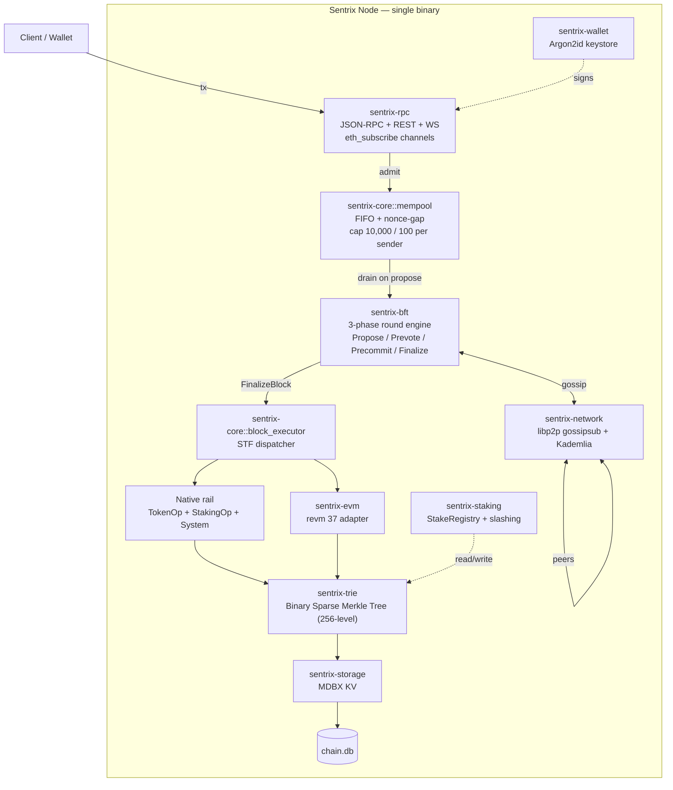
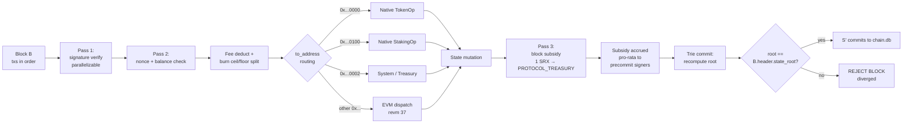

# Sentrix

### Blockchain Layer-1 — Spesifikasi Protokol

**Penulis:** Satya Kwok &lt;satya@sentrixchain.com&gt;
**Web:** sentrixchain.com
**Versi:** 1.3.0 (menggantikan 1.2.4)

---

## Abstrak

Dokumen ini menentukan *Sentrix*, sebuah blockchain Layer-1 yang memadukan protokol konsensus Byzantine Fault Tolerant (BFT) ala Tendermint dengan seleksi validator delegated-proof-of-stake, lapisan eksekusi dual-rail deterministik (rel operasi protokol native dan rel Ethereum Virtual Machine yang berjalan di atas `revm`), dan komitmen state berupa binary sparse Merkle tree. Kami memberikan model sistem formal, struktur pesan dan logika ronde protokol konsensus dengan kondisi safety/liveness, pipeline eksekusi termasuk desain forward-looking parallel-execution, model performa dengan ekspresi closed-form untuk throughput dan latency, model adversarial dengan batas keamanan kuantitatif, dan protokol penanganan kegagalan eksplisit untuk empat kelas fault yang telah ditemui oleh deployment produksi. Paper ini ditujukan sebagai spesifikasi yang dapat diaudit oleh engineer, bukan dokumen pemasaran.

Chain ini berjalan di produksi pada chain ID `7119` (mainnet) dan `7120` (testnet) di bawah implementasi Rust open-source di `github.com/sentrix-labs/sentrix`. Konstanta ekonomi — pasokan maksimum 315M SRX, block reward awal 1 SRX yang halving setiap 126M blok, 50% dari setiap fee transaksi dibakar — dikodifikasi pada level protokol dan tidak dapat diubah governance.

---

## 1. Pendahuluan

### 1.1 Cakupan

Dokumen ini menentukan protokol Sentrix pada level yang cukup bagi seorang engineer untuk (a) mengimplementasikan node yang conforming, (b) mengaudit divergensi antara dua implementasi, atau (c) bernalar tentang perilaku chain di bawah kondisi adversarial atau partial-failure. Ini bukan pengantar terhadap sistem terdistribusi atau primitif blockchain; familiaritas dengan state-machine replication, konsensus Byzantine, dan model eksekusi Ethereum diasumsikan.

Konstanta, fork height, parameter slashing, dan alamat routing yang dikutip di seluruh dokumen ini dipinned ke implementasi Rust di workspace `github.com/sentrix-labs/sentrix` per release `v2.1.56`. Di mana implementasi memiliki nilai parametrik yang dikonfigurasi pada genesis atau melalui environment variable, dokumen menandai nilai tersebut sebagai *parametrik* dan menunjuk modul yang relevan.

### 1.2 Tujuan Desain

Protokol memprioritaskan, secara berurutan:

1. **Kesepakatan state deterministik** — setiap node jujur yang mengeksekusi blok yang sama terhadap state sebelumnya yang sama menghasilkan hasil yang bit-identik.
2. **Finalitas single-block** — setelah sebuah blok di-commit, tidak ada fork yang dapat menggantikannya tanpa melanggar threshold safety BFT.
3. **Kompatibilitas EVM** — kontrak Solidity dan tooling Ethereum standar bekerja tanpa modifikasi.
4. **Target waktu blok satu detik** — pada struktur ronde BFT yang dideskripsikan di §4 dan di bawah asumsi jaringan §2.2.
5. **Kesederhanaan operator** — chain ini ship sebagai single Rust binary; operator menjalankan satu proses dan mengelola satu key-value store lokal.
6. **Kebijakan moneter yang dapat diprediksi** — pasokan, cadensi halving, rasio fee burn, dan alokasi genesis tidak dapat diatur governance.

### 1.3 Non-Tujuan

Protokol secara eksplisit tidak menargetkan:

- **Throughput maksimum apa pun harganya.** Batas throughput (§10) adalah trade-off terhadap finalitas single-block dan kebutuhan validator-set kecil.
- **Privasi on-chain.** Setiap transaksi, saldo, dan call dapat diobservasi publik. Privasi didelegasikan ke lapisan aplikasi.
- **Sharding.** State dan eksekusi tidak di-shard. Bagian 10 menurunkan batas skalabilitas yang konsekuensinya.
- **Eksekusi multi-VM polyglot.** Protokol secara native mendukung EVM dan rel native dengan ABI tetap; plug-in VM arbitrer berada di luar cakupan.

---

## 2. Model Sistem

### 2.1 Notasi

Sepanjang dokumen, kami menggunakan simbol berikut:

| Simbol | Makna |
|---|---|
| `n` | Jumlah validator aktif pada epoch saat ini |
| `f` | Jumlah maksimum validator Byzantine yang ditoleransi, `f = ⌊(n − 1) / 3⌋` |
| `Q` | Quorum supermayoritas BFT, `Q = ⌊2n/3⌋ + 1`. Untuk `n = 4`, `Q = 3`. Untuk `n = 21`, `Q = 15`. |
| `S` | State chain kanonis, `S ∈ 𝒮` |
| `S₀` | State genesis |
| `B` | Blok, `B = (header, txs)` |
| `H(B)` | Hash kriptografis dari encoding kanonis `B` |
| `STF` | State transition function, `STF: 𝒮 × ℬ → 𝒮 ∪ {⊥}` |
| `h` | Block height, monotonically increasing |
| `r` | Ronde BFT pada height tertentu, `r ∈ {0, 1, …, MAX_ROUND}` |
| `Δ` | Batas atas message delay setelah global stabilisation time (GST) |
| `Vₐ` | Set validator aktif untuk epoch saat ini, `|Vₐ| = n ≤ MAX_ACTIVE_VALIDATORS` |
| `s(v)` | Stake-weight dari validator `v ∈ Vₐ` |

`SRX` adalah aset chain native; `1 SRX = 10⁸ sentri` (unit terkecil yang tidak dapat dibagi). Semua jumlah token dalam dokumen ini diekspresikan dalam sentri kecuali dinyatakan lain secara eksplisit.

### 2.2 Model Jaringan

Kami mengasumsikan **partial synchrony** dalam pengertian Dwork–Lynch–Stockmeyer [15]: terdapat waktu `GST` (Global Stabilisation Time) yang tidak diketahui namun finite, di mana setelahnya semua pesan antar partisipan jujur tersampaikan dalam delay terbatas `Δ`. Sebelum `GST`, pesan dapat di-delay secara arbitrer, di-reorder, atau di-drop. Protokol harus tetap *safe* di bawah asynchrony arbitrer dan menjadi *live* setelah partial synchrony berlaku.

Komunikasi inter-validator berlangsung di atas mesh libp2p [11] (§7) dengan tiga kelas pesan (block gossip, transaction gossip, pesan BFT). Pesan diautentikasi oleh signature validator. Protokol tidak mengasumsikan delivery FIFO atau transport reliable; lapisan aplikasi bertanggung jawab untuk retransmission dan deduplication.

### 2.3 Model Adversarial

Kami mengadopsi model adversarial BFT standar:

- **Validator jujur** mengikuti protokol secara persis.
- **Validator Byzantine** dapat menyimpang secara arbitrer — termasuk menandatangani pesan yang konflik, menahan pesan, melakukan ekuivokasi pada proposal, atau berkoordinasi dengan validator Byzantine lainnya.
- Adversary mengontrol fraksi `β` dari active set yang dibobotkan stake, `β ∈ [0, 1]`.

Protokol menjamin safety asalkan `β < 1/3` (yakni kurang dari `n/3` validator menurut stake adalah Byzantine). Protokol menjamin liveness di bawah asumsi tambahan partial synchrony (§2.2) ketika `β < 1/3`.

Adversary terbatas secara komputasional; secara spesifik, adversary tidak dapat memalsukan signature ECDSA, menemukan tabrakan SHA-256, atau memecahkan asumsi discrete-log dari grup secp256k1.

### 2.4 State Machine Replication

Sentrix adalah instance state machine replication. Setiap validator memelihara replika identik dari `S`. Klien submit transaksi; konsensus mengurutkannya ke dalam blok; setiap replika menerapkan blok melalui `STF` dalam urutan yang sama, menurunkan state penerus yang sama.

Secara formal:

> **(SMR Property)** Untuk setiap validator jujur `v` dan setiap height `h`, setelah `v` menerapkan semua blok `B₁, …, Bₕ`, state `Sₕ` yang dihasilkan tidak bergantung pada `v`. Yakni, `∀ v, v′ jujur: Sₕ(v) = Sₕ(v′)`.

Properti SMR dicapai melalui (a) protokol konsensus yang menyepakati satu blok per height (§4 safety) dan (b) determinisme dari `STF` (§5.2).

---

## 3. Arsitektur

Node adalah single Rust binary yang terdiri dari subsistem-subsistem yang berbagi state kanonis `S`:



**Gambar 1.** Arsitektur sistem. Block executor menerima aksi `FinalizeBlock` dari BFT engine setelah konsensus dan men-dispatch setiap transaksi melalui aturan routing di §5.5. Lapisan trie + storage di-share lintas rel; tidak ada execution database terpisah.

14 crate dari workspace (`crates/sentrix-{primitives,codec,wire,trie,storage,wallet,bft,staking,network,evm,precompiles,core,rpc-types,rpc}`) di-compile menjadi binary `sentrix` tunggal di `bin/sentrix`. Sebuah `bin/sentrix-faucet` terpisah ada untuk operasi testnet dan bukan bagian dari konsensus.

---

## 4. Protokol Konsensus (Voyager BFT)

Konsensus Sentrix adalah turunan Tendermint yang kami sebut *Voyager*. Bagian ini menentukan struktur ronde, tipe pesan, aturan locking, dan kondisi safety/liveness.

### 4.1 Seleksi Validator (DPoS)

Set validator aktif `Vₐ` untuk sebuah epoch dipilih melalui ranking yang dibobotkan stake. Setiap akun yang telah mengeksekusi `RegisterValidator` dan mengikat self-stake minimum yang dikonfigurasi genesis adalah seorang *kandidat*. Pemegang token dapat mendelegasikan stake ke kandidat melalui operasi `Delegate`. Active set untuk epoch `e + 1` adalah top-`MAX_ACTIVE_VALIDATORS = 21` kandidat yang di-rank oleh `total_stake = self_stake + total_delegated`, dikomputasi secara deterministik pada blok batas `h = e × EPOCH_LENGTH` di mana `EPOCH_LENGTH = 28_800` blok (~8 jam pada blok 1 detik).

Penarikan stake memulai *periode unbonding* selama `UNBONDING_PERIOD = 201_600` blok, di mana stake tetap dapat di-slash namun tidak menghasilkan reward. Ini mencegah validator Byzantine meng-offload stake yang dapat di-slash segera sebelum melakukan ekuivokasi.

`AddSelfStake` (di-gate oleh `ADD_SELF_STAKE_HEIGHT`, diaktifkan 2026-04-28) memungkinkan validator yang teregister meningkatkan self-stake-nya dari dompetnya sendiri tanpa register ulang, digunakan dalam alur unjail dan top-up stake.

### 4.2 Struktur Ronde

Sebuah *height* `h` difinalisasi melalui satu atau lebih *ronde* `r ∈ {0, 1, …, MAX_ROUND}` di mana `MAX_ROUND = 100`. Setiap ronde terdiri dari tiga fase — `PROPOSE`, `PREVOTE`, `PRECOMMIT` — diikuti oleh fase `FINALIZE` jika quorum tercapai. Keempat fase di-encode dalam `BftPhase = {Propose, Prevote, Precommit, Finalize}`.

Untuk ronde `(h, r)`, *proposer* dipilih melalui

$$
\text{propose}(h, r) = V_a[(h + r) \bmod n]
$$

Round-robin atas active set; stake-weight tidak memengaruhi seleksi proposer dalam sebuah epoch (nama fungsi `weighted_proposer` di `crates/sentrix-staking/src/staking.rs` adalah peninggalan historis).

Tiga tipe pesan beredar:

| Tipe | Field yang dibawa | Peran |
|---|---|---|
| `Proposal(h, r, B)` | `height, round, block_hash, sig` | Klaim proposer bahwa `B` adalah blok berikutnya pada `(h, r)` |
| `Prevote(h, r, x)` | `height, round, x ∈ {block_hash, ⊥}, sig` | Vote validator |
| `Precommit(h, r, x)` | `height, round, x ∈ {block_hash, ⊥}, sig` | Komitmen validator |

Sebuah signature adalah signature ECDSA recoverable secp256k1 65-byte (compact `(r, s)` 64-byte plus satu byte `recovery_id`), dikomputasi atas SHA-256 dari payload signing kanonis yang berisi prefix domain-separation (`0x01` proposal, `0x02` prevote, `0x03` precommit). Signature proposer pada `Proposal` juga mencakup isi `B`. Pesan tingkat wire dibungkus di `BftMessage = {Propose(Proposal), Prevote(Prevote), Precommit(Precommit), RoundStatus(RoundStatus)}` untuk transport.

#### 4.2.1 PROPOSE

Proposer untuk `(h, r)` mengkonstruksi blok kandidat `B`:

```
B = {
    header: {
        index: h,
        previous_hash: H(B_{h-1}),
        timestamp: now(),
        proposer: addr(propose(h, r)),
        state_root: STF(S_{h-1}, B).root,    // STAGED — see §5
        justification: J_{h-1},               // precommits proving B_{h-1} finalized
        merkle_root: tx_merkle(B.txs),
    },
    txs: drain_mempool(MAX_TX_PER_BLOCK = 5_000)
}
```

Proposer melakukan broadcast `Proposal(h, r, B)` ke seluruh `Vₐ`. Validator jujur menunggu paling lama `propose_timeout(r) = min(20_000 + r × 1_000, 30_000) ms` untuk proposal; pada timeout mereka memperlakukan proposal sebagai `⊥` dan lanjut ke `PREVOTE`.

Timeout ini adalah batas atas, bukan durasi fase. Pada happy path di mesh latency rendah, ketiga fase selesai jauh di bawah satu detik; chain memproduksi blok pada target `BLOCK_TIME_SECS = 1`. Timeout yang lebar ada untuk menyerap perbaikan peer-mesh setelah disconnect transien (lihat `crates/sentrix-bft/src/engine/timeouts.rs` untuk riwayat insiden).

#### 4.2.2 PREVOTE

Setiap validator `v ∈ Vₐ` mengevaluasi proposal:

- Jika `B` valid (signature, parent hash, signature transaksi, state root) dan `v` tidak terkunci pada blok berbeda di height ini, `v` melakukan broadcast `Prevote(h, r, H(B))`.
- Jika tidak, `v` melakukan broadcast `Prevote(h, r, ⊥)`.

Validator kemudian menunggu prevote dari validator yang membawa total stake ≥ `Q`. Jika `Q` validator menurut stake-weight melakukan prevote untuk `H(B)` yang sama (sebuah *polka*), `v` lanjut ke `PRECOMMIT` dengan `H(B)`. Jika tidak, `v` lanjut dengan `⊥`.

Timeout: `prevote_timeout(r) = min(12_000 + r × 2_000, 30_000) ms`.

#### 4.2.3 PRECOMMIT

Setiap validator melakukan broadcast `Precommit(h, r, x)`:

- `x = H(B)` jika `v` melihat polka untuk `H(B)` di fase prevote.
- `x = ⊥` jika tidak.

Sebuah validator menunggu precommit yang membawa total stake ≥ `Q`. Jika `Q` precommit setuju pada `H(B)`, `B` *difinalisasi* di height `h`.

Timeout: `precommit_timeout(r) = min(12_000 + r × 2_000, 30_000) ms`.

#### 4.2.4 FINALIZE

Set `Q` precommit merupakan *justifikasi* `Jₕ` untuk blok `B`. `Jₕ` disertakan di header blok berikutnya (`B_{h+1}.header.justification`), memberikan bukti publik finalisasi.

Setiap validator menerapkan `B` ke state lokalnya melalui `STF` (§5) dan melanjutkan ke ronde `0` dari height `h + 1`.

### 4.3 Locking

Setelah validator melakukan prevote sebuah blok di ronde `r`, ia terkunci pada blok dan ronde tersebut (`locked_block` dan `locked_round` di-persist di `BftRoundState`). Pada ronde-ronde berikutnya di height yang sama, ia hanya akan melakukan prevote terhadap blok berbeda jika ia mengamati polka (≥ `Q` prevote untuk alternatif yang sama) di ronde *yang lebih tinggi*. Aturan inilah yang menjamin safety:

> **(Locking Invariant)** Sebuah validator jujur yang melakukan precommit `H(B)` di ronde `r` hanya melakukan precommit blok berbeda `H(B′)` di ronde `r′ > r` jika `≥ Q` prevote untuk `H(B′)` diamati di suatu ronde `r′′` dengan `r ≤ r′′ < r′`.

Karena `≥ Q` validator jujur harus melepaskan kuncinya pada `H(B)` untuk melakukan prevote `H(B′)`, dan melepaskan kunci memerlukan pengamatan polka alternatif, tidak ada validator jujur yang melakukan precommit terhadap `H(B)` dan `H(B′)` sekaligus.

### 4.4 Round Skip

Jika sebuah ronde gagal difinalisasi dalam timeout fase-nya plus `ε`, ronde berakhir dan ronde `r + 1` dimulai. Proposer berotasi ke `Vₐ[(h + r + 1) mod n]`.

Advancement ronde bersifat **timeout-only** (per fix `2026-04-17`, lihat doc `crates/sentrix-bft/src/lib.rs`): tidak ada catch-up yang dipicu vote atau `RoundStatus` yang mempromosikan validator melintas ronde. Ini menghindari stall *validator-leapfrog* di mana validator membersihkan vote yang dikumpulkan pada setiap lompatan ronde.

Timeout per-fase tumbuh linier dengan nomor ronde untuk menyerap partial synchrony berkelanjutan:

```
propose_timeout(r)   = min(20_000 + r × 1_000, 30_000) ms
prevote_timeout(r)   = min(12_000 + r × 2_000, 30_000) ms
precommit_timeout(r) = min(12_000 + r × 2_000, 30_000) ms
```

Sekali timeout fase apa pun mencapai cap 30 s, ia tidak tumbuh lebih lanjut. Setelah `MAX_ROUND = 100` ronde berturut-turut yang gagal pada satu height, chain dianggap stalled pada height tersebut; pemulihan memerlukan intervensi operator (§11.1).

### 4.5 Sekuens Konsensus

```mermaid
sequenceDiagram
    autonumber
    participant P as Proposer (h,r)
    participant V1 as Validator v₁
    participant V2 as Validator v₂
    participant Vn as Validator v_n
    Note over P,Vn: PROPOSE (timeout 20s + r×1s, capped 30s)
    P->>V1: Proposal(h, r, B)
    P->>V2: Proposal(h, r, B)
    P->>Vn: Proposal(h, r, B)
    Note over P,Vn: PREVOTE (timeout 12s + r×2s, capped 30s)
    V1-->>P: Prevote(h, r, H(B))
    V1-->>V2: Prevote(h, r, H(B))
    V2-->>V1: Prevote(h, r, H(B))
    V2-->>Vn: Prevote(h, r, H(B))
    Vn-->>P: Prevote(h, r, H(B))
    Note over P,Vn: ≥Q stake-weighted prevotes → polka
    Note over P,Vn: PRECOMMIT (timeout 12s + r×2s, capped 30s)
    V1-->>P: Precommit(h, r, H(B))
    V2-->>P: Precommit(h, r, H(B))
    Vn-->>P: Precommit(h, r, H(B))
    Note over P,Vn: ≥Q stake-weighted precommits → FINALIZE
    Note over P,Vn: B finalized; J_h = {Precommits}
    Note over P,Vn: Apply STF; advance to (h+1, 0)
```

**Gambar 2.** Ronde Voyager BFT dalam happy path. Timeout berlabel adalah batas atas untuk setiap fase; pada mesh sehat ronde selesai dalam waktu jauh lebih sedikit, dan chain memproduksi blok pada target 1 s.

### 4.6 Safety

**Teorema 1 (Agreement).** *Untuk semua height `h`, tidak ada dua validator jujur yang memfinalisasi blok berbeda di height `h`, asalkan `β < 1/3` dari stake adalah Byzantine.*

**Sketsa pembuktian.** Misalkan validator jujur `v₁` dan `v₂` memfinalisasi `B` dan `B′` di height `h` dengan `H(B) ≠ H(B′)`. Masing-masing melihat `Q` precommit untuk blok masing-masing. Dengan `Q = ⌊2n/3⌋ + 1` dan `f = ⌊(n − 1)/3⌋`, kita memiliki `2Q − n ≥ f + 1`, sehingga kedua set precommit berbagi setidaknya `f + 1` validator. Di antara validator yang dibagi ini setidaknya satu adalah jujur (karena paling banyak `f` adalah Byzantine). Sebuah validator jujur yang melakukan precommit `H(B)` tidak dapat melakukan precommit `H(B′)` tanpa polka antara untuk `H(B′)` (Locking Invariant, §4.3). Agar polka terjadi, validator yang membawa total stake `≥ Q` harus telah melakukan prevote `H(B′)`, yang mengharuskan setidaknya `Q − f > f` validator jujur melepaskan kunci mereka pada `H(B)` — bertentangan dengan Locking Invariant untuk validator-validator tersebut. ∎

**Teorema 2 (Validity).** *Setiap blok yang difinalisasi adalah well-formed: header-nya valid, semua signature transaksi terverifikasi, state root cocok dengan eksekusi `STF`, dan justifikasinya adalah set `Q`-precommit yang valid pada parent-nya.*

**Pembuktian.** Validator jujur hanya melakukan prevote terhadap blok well-formed (§4.2.2). Untuk finalisasi, `Q ≥ n − f` validator melakukan precommit, di mana setidaknya `Q − f ≥ n − 2f > f` adalah jujur. Precommit jujur memerlukan prevote jujur, dan prevote jujur memerlukan blok valid. ∎

### 4.7 Liveness

**Teorema 3 (Termination).** *Di bawah partial synchrony (§2.2) dan `β < 1/3`, setiap height pada akhirnya difinalisasi dalam `MAX_ROUND` ronde.*

**Sketsa pembuktian.** Setelah `GST`, semua pesan antar validator jujur tersampaikan dalam `Δ`. Mekanisme round-skip (§4.4) pada akhirnya memilih timeout yang lebih besar dari `Δ` (di-cap pada 30 s, cukup untuk `Δ` apa pun yang masuk akal dalam kondisi jaringan produksi). Dalam ronde semacam itu, `Proposal` dari proposer jujur mencapai semua validator jujur tepat waktu, semua prevote jujur mencapai semua validator jujur tepat waktu (menghasilkan polka stake `≥ n − f ≥ Q`), dan demikian pula untuk precommit. Blok difinalisasi. Seleksi proposer round-robin (§4.2) menjamin proposer jujur dipilih dalam paling banyak `f + 1` ronde berturut-turut, jauh di dalam `MAX_ROUND = 100`. ∎

### 4.8 Kompleksitas Pesan

Per ronde, setiap validator melakukan broadcast satu `Prevote` dan satu `Precommit`. Proposer secara tambahan melakukan broadcast satu `Proposal`. Dengan `n` validator, pesan originating per-ronde adalah persis `2n + 1` (satu proposal, `n` prevote, `n` precommit). Di bawah delivery all-to-all melalui mesh gossipsub, total byte yang ditransfer berskala sebagai `O(n²)` di kasus terburuk; dengan gossip optimal total amortisasi menjadi `O(n log n)`.

Untuk `n = 4` (mainnet saat ini, `Q = 3`), pesan per-ronde adalah `2 × 4 + 1 = 9`. Untuk ukuran active-set maksimum `n = 21` (`Q = 15`), pesan per-ronde adalah `2 × 21 + 1 = 43`. Kedua regime berada jauh di dalam envelope throughput gossip libp2p.

### 4.9 BFT Gate Relax

Pre-fork, protokol mengharuskan seluruh active set online (`active = n`) untuk membuat progress konsensus. Post `BFT_GATE_RELAX_HEIGHT`, kebutuhan diturunkan menjadi `active ≥ ⌈2n/3⌉`, memberikan margin toleransi satu-jail untuk `n = 4` (memungkinkan chain advance dengan tiga dari empat penanda saat satu di-jail). Gate dikontrol operator melalui environment variable `BFT_GATE_RELAX_HEIGHT`; default-nya `u64::MAX` (disabled).

---

## 5. Lapisan Eksekusi

Lapisan eksekusi mengimplementasikan `STF: 𝒮 × ℬ → 𝒮 ∪ {⊥}`. Ia men-dispatch transaksi ke salah satu dari dua rel — *native* atau *EVM* — berdasarkan `to_address` transaksi, menerapkan side effect ke state kanonis, dan mengkomputasi state root yang dihasilkan.

### 5.1 Pipeline



**Gambar 3.** Pipeline eksekusi. Setiap transaksi melewati verifikasi signature, penanganan fee, dispatch rel, dan mutasi state. Block subsidy diaplikasikan satu kali per blok di akhir; state trie dikomputasi ulang, dan root yang dihasilkan dicek terhadap klaim proposer. Pass 1 (verifikasi signature) dapat diparalelkan secara independen per transaksi; Pass 2 dan setelahnya bersifat strict sequential menurut urutan `B.txs` (§5.2).

### 5.2 Aksioma Determinisme

Agar `STF` memenuhi SMR Property (§2.4), setiap implementasi harus deterministik dalam tiga pengertian:

**(D1) Urutan operasi.** Transaksi diaplikasikan dalam urutan `B.txs`. Tidak ada reordering, tidak ada parallel-execution-with-merge yang menghasilkan urutan commit berbeda.

**(D2) Konsistensi pembacaan state.** Pembacaan state suatu transaksi pada titik eksekusinya merefleksikan semua transaksi sebelumnya di blok yang sama. Tidak ada snapshot isolation, tidak ada divergensi read-after-write.

**(D3) Bebas floating-point.** Tidak ada mutasi state yang bergantung pada aritmatika IEEE-754. Semua perhitungan adalah integer atau fixed-point. Sentrix menggunakan `u64` sentri di seluruh sistem; komputasi yang berdenominasi SRX adalah kelipatan integer atau quotient (mis. `total_fee.div_ceil(2)` untuk burn share, §8.3).

Aksioma ini berlaku untuk implementasi sequential saat ini. Mereka juga adalah constraint yang harus dipenuhi setiap skema parallel-execution masa depan (§5.6): sebuah eksekusi paralel valid jika dan hanya jika ia menghasilkan state yang tidak dapat dibedakan dari eksekusi sequential yang didefinisikan oleh urutan `B.txs`.

### 5.3 State Transition Function

```
STF(S, B):
  // Pass 0: header validation
  1.  verify B.header.previous_hash == H(B_{h-1})
  2.  verify B.header.proposer == propose(B.header.index, r)
                                  for some round r ≤ MAX_ROUND
                                  (round determined by justification)
  3.  verify B.header.justification is a valid Q-precommit set on B_{h-1}
  4.  S' ← S

  // Pass 1: transaction signature verification (parallelizable)
  5.  for each tx in B.txs:
      a. verify ECDSA(tx.signature, canonical_signing_payload(tx),
                       tx.public_key)
      b. verify keccak256(tx.public_key)[12:] == tx.from_address

  // Pass 2: sequential apply (D1)
  6.  for each tx in B.txs (in order):
      a. if S'[tx.from].nonce ≠ tx.nonce: skip
      b. if tx.fee < MIN_TX_FEE: skip
      c. if S'[tx.from].balance < tx.fee + tx.amount: skip
      d. S'[tx.from].balance -= tx.fee
      e. // burn share is debited but never credited;
         // total_burned is tracked in chain accounting
         total_burned_srx += tx.fee.div_ceil(2)
      f. dispatch tx based on tx.to_address (Table 5.5):
         - TOKEN_OP_ADDRESS  (0x...0000) → native TokenOp
         - STAKING_ADDRESS   (0x...0100) → native StakingOp
         - PROTOCOL_TREASURY (0x...0002) → system/claim path
         - any other         → EVM dispatch via revm
      g. if dispatch fails:
           - revert state changes for this tx (step f side-effects)
           - keep fee deduction (step d) and burn debit (step e)
      h. S'[tx.from].nonce += 1

  // Pass 3: validator fee credit (per block, not per tx)
  7.  let total_fee = Σ tx.fee for tx in B.txs (admissible)
  8.  let validator_share = total_fee - total_fee.div_ceil(2)
                          // = floor(total_fee / 2)
  9.  S'[B.header.proposer].balance += validator_share

  // Pass 4: block subsidy
  10. let subsidy = block_reward(B.header.index)
                  = max(BLOCK_REWARD ÷ 2^era, 0) where
                    era = ⌊B.header.index / HALVING_INTERVAL_V2⌋
  11. S'[PROTOCOL_TREASURY].balance += subsidy
  12. for each precommitter v in B_{h-1}.justification.precommits:
        S'.staking.pending_rewards[v] += subsidy × s(v) / Σ s(precommitters)
                                         × (1 − commission(v) for delegators)

  // Pass 5: trie commit
  13. recompute root R from S' (binary sparse Merkle, depth 256)
  14. if h ≥ STATE_ROOT_FORK_HEIGHT and R ≠ B.header.state_root:
        return ⊥
  15. return S'
```

`STF` deterministik berdasarkan D1–D3 (§5.2), sehingga setiap validator jujur mengkomputasi `S'` yang sama dari `(S, B)` yang sama. Divergensi pada langkah 14 mengindikasikan baik (a) proposer Byzantine yang mengusulkan blok yang state root yang diklaim tidak cocok dengan eksekusi yang benar, atau (b) bug pada executor lokal.

Pengecekan state root di-gate oleh `STATE_ROOT_FORK_HEIGHT = 100_000`. Blok pre-fork tidak di-commit ke state root di header-nya; determinisme bytewise chain adalah satu-satunya consensus binding untuk blok-blok tersebut. Post-fork, state root adalah bagian dari block hash dan divergensi apa pun membatalkan apply.

### 5.4 Native Rail

Native rail men-dispatch tiga kelas operasi berdasarkan `to_address`:

**TokenOp** (`TOKEN_OP_ADDRESS = 0x00…0000`)
Di-encode sebagai JSON kanonis `{"op": "...", ...}` di `tx.data`. Variant: `Deploy`, `Transfer`, `Burn`, `Mint`, `Approve` (fungible SRC-20). Variant `DeployNft`, `MintNft`, `TransferNft`, `BurnNft`, `Deploy1155`, `Mint1155`, `Transfer1155`, `Burn1155` (NFT SRC-721 / SRC-1155) wire-format-nya stabil namun dispatch-nya di-gate oleh `NFT_TOKENOP_HEIGHT = u64::MAX` (disabled) menunggu lapisan storage Pass-2.

**StakingOp** (`STAKING_ADDRESS = 0x00…0100`)
Di-encode sebagai JSON kanonis. Variant: `RegisterValidator`, `Delegate`, `Undelegate`, `Redelegate`, `ClaimRewards`, `Unjail`, `AddSelfStake`, `SubmitEvidence`, `JailEvidenceBundle`. Yang terakhir di-gate oleh `JAIL_CONSENSUS_HEIGHT = u64::MAX` (dispatch jail yang dikomputasi konsensus di-defer menunggu fix root cause non-determinisme).

**System** (`PROTOCOL_TREASURY = 0x00…0002`)
Operasi treasury (drain reward escrow), diimplementasikan di dalam executor alih-alih sebagai enum op user-facing.

Native rail bypass revm sepenuhnya. Op native berbiaya `MIN_TX_FEE = 10_000 sentri` flat, terlepas dari operasi. Operasi native saling beroperasi dengan EVM rail melalui state kanonis: kontrak EVM dapat membaca saldo SRC-20 native melalui precompile; state staking native serupa dapat dibaca.

### 5.5 EVM Rail

Untuk `to_address` lainnya, dispatcher menginvoke `revm 37` melalui adapter `sentrix-evm` dengan state provider yang di-back oleh chain trie. Semantik EVM standar berlaku: gas accounting mengikuti EIP-1559 [13] (`baseFeePerGas` per-blok plus tip yang ditetapkan pengirim), perilaku opcode cocok dengan Ethereum mainnet kecuali untuk chain ID (`7119` mainnet, `7120` testnet). Tooling standar (Foundry, Hardhat, MetaMask, ethers, viem) saling beroperasi tanpa modifikasi.

Sisi-EVM `eth_sendRawTransaction` masuk ke lapisan translation yang membungkus transaksi RLP-encoded EIP-155 ke dalam form transaksi Sentrix kanonis (§5.7) sebelum admission ke mempool. Verifikasi signature EIP-155 terjadi sebelum translation; gossip dan finalisasi identik dari sana.

Transfer value EVM (sebuah `tx.value` non-zero yang menyertai contract call) di-gate oleh `EVM_VALUE_TRANSFER_HEIGHT = u64::MAX` (disabled) menunggu investigasi divergensi eager-write yang memotivasi fork-gate v2.1.50. Operator menyalakan gate melalui environment variable `EVM_VALUE_TRANSFER_HEIGHT` ketika apply EVM Pass-2 telah diverifikasi konsisten lintas cluster.

Routing diringkas dalam:

| Sentinel `to_address` | Nama konstanta | Rel / Kelas |
|---|---|---|
| `0x0000000000000000000000000000000000000000` | `TOKEN_OP_ADDRESS` | Native TokenOp |
| `0x0000000000000000000000000000000000000100` | `STAKING_ADDRESS` | Native StakingOp |
| `0x0000000000000000000000000000000000000002` | `PROTOCOL_TREASURY` | System / Treasury |
| selain itu | — | EVM via revm |

### 5.6 Forward-Looking Parallel Execution

Eksekusi di dalam sebuah blok saat ini bersifat strict sequential (D1, §5.2). Plafon throughput yang dipaksakan oleh protokol adalah

```
TPS_max = MAX_TX_PER_BLOCK / BLOCK_TIME_SECS = 5_000 / 1 = 5_000 tx/s
```

Rate yang dapat dicapai pada deployment spesifik mana pun dibatasi oleh throughput apply single-threaded (verifikasi signature, cek nonce/saldo, dispatch, write trie). Di luar regime di mana sequential apply menjenuhkan satu CPU core, parallel execution menjadi diperlukan.

Model forward-looking parallel-execution mengadopsi skema *optimistic concurrency control* yang terinspirasi oleh Block-STM [16] dan model pipelined execution Monad [18]:

1. **Static dependency hint.** Setiap transaksi mendeklarasikan (atau dispatcher menginferensikan) sebuah *read-set* dan *write-set*. Untuk op native, set-set ini diturunkan dari argumen operasi (mis. `Delegate.validator` adalah satu-satunya write stake-registry). Untuk dispatch EVM, set-set di-over-approximate dari trace blok sebelumnya.
2. **Identifikasi independent-batch.** Bangun graph dependency berarah `G = (V, E)` di mana `tx_i → tx_j` iff read-set `tx_j` beririsan dengan write-set `tx_i` dan `j > i` dalam urutan blok. Komputasi node root dari `G`; node-node ini dieksekusi paralel. Setelah setiap batch di-commit, update `G` dan identifikasi layer berikutnya.
3. **Re-eksekusi optimistic.** Transaksi yang dependency-nya di-over-approximate dieksekusi spekulatif; pada write-conflict, abort dan re-eksekusi transaksi yang konflik secara sequential.
4. **Sequential commit.** Aplikasikan write setiap transaksi ke state kanonis dalam urutan `B.txs` terlepas dari urutan eksekusi. Ini menjaga D1 — schedule *commit* sama dengan urutan blok.

Perubahan protokol yang dibutuhkan adalah: (a) deklarasi read/write set di metadata transaksi, (b) state provider yang ramah eksekusi spekulatif, (c) aturan resolusi konflik deterministik. Implementasi di-sequence setelah chain mencapai baseline single-implementation yang stabil; produksi saat ini menjalankan jalur sequential apply, dan tidak ada perubahan lapisan konsensus yang dibutuhkan untuk mengaktifkan parallel execution kemudian.

### 5.7 Format Transaksi

Sebuah transaksi adalah unit perubahan state. Format wire kanonisnya adalah (`crates/sentrix-primitives/src/transaction.rs`):

```rust
pub struct Transaction {
    pub txid:         String,      // hex-encoded SHA-256 of canonical signing payload
    pub from_address: String,      // hex-encoded 20-byte address (ECDSA-recovered)
    pub to_address:   String,      // hex-encoded 20-byte address (routing key, §5.5)
    pub amount:       u64,         // sentri (1 SRX = 10⁸ sentri)
    pub fee:          u64,         // sentri, ≥ MIN_TX_FEE = 10_000
    pub nonce:        u64,         // sender account sequence
    pub data:         String,      // empty for plain transfers;
                                   // canonical JSON for native ops;
                                   // EVM call payload for EVM dispatch
    pub timestamp:    u64,         // unix seconds (anti-replay window)
    pub chain_id:     u64,         // 7119 mainnet, 7120 testnet
    pub signature:    String,      // hex secp256k1 ECDSA, 65 bytes (r, s, v)
    pub public_key:   String,      // hex secp256k1 uncompressed, 65 bytes
}
```

Ukuran transaksi maksimum adalah `MAX_TX_SIZE = 128 KB`. Mempool menerima paling banyak `MAX_MEMPOOL_SIZE = 10_000` transaksi secara global, dengan `MAX_MEMPOOL_PER_SENDER = 100` per pengirim; transaksi yang lebih tua dari `MEMPOOL_MAX_AGE_SECS = 3_600` di-evict.

Payload yang ditandatangani adalah serialisasi JSON kanonis dari delapan field konten (`amount`, `chain_id`, `data`, `fee`, `from`, `nonce`, `timestamp`, `to`) dalam urutan key leksikografis. Payload di-hash dengan SHA-256; digest 32-byte yang dihasilkan ditandatangani dengan secp256k1 ECDSA.

Sisi-EVM `eth_sendRawTransaction` masuk ke lapisan translation yang dideskripsikan di §5.5; dompet sisi-native yang menandatangani payload Sentrix kanonis langsung (mis. `solux.sentriscloud.com`) submit ke endpoint `sentrix_sendTransaction`.

---

## 6. Lapisan State

### 6.1 Komitmen Trie

State kanonis di-commit melalui *binary sparse Merkle tree* dengan kedalaman 256 [9] (`crates/sentrix-trie`). Setiap leaf di-key oleh hash 256-bit dari alamat akun dan slot storage. Hash root `R(S)` disertakan di header blok sebagai `B.header.state_root`.

Untuk akun `a`, bukti inklusi adalah `O(log₂ N)` di mana `N` adalah jumlah leaf yang terisi. Light client memverifikasi setiap fakta tentang `S` terhadap `R(S)` dengan path Merkle berukuran logaritmik.

Komitmen state root di-gate oleh `STATE_ROOT_FORK_HEIGHT = 100_000` (§5.3). Di bawah height ini chain advance hanya melalui konsensus bytewise; di atasnya state root adalah bagian dari block hash dan divergensi apa pun membatalkan apply.

### 6.2 Persistensi State

State di-persist di MDBX [10] (`crates/sentrix-storage`), sebuah memory-mapped key-value store. Read amplification bersifat terbatas; write amplification bersifat constant-time per update leaf. Ukuran state tumbuh dengan jumlah akun unik, slot storage kontrak, dan record blok historis.

Sebuah node memelihara persis satu file `chain.db`. Pemulihan dari korupsi (mis. `MDBX_MAP_FULL` dari tekanan disk, atau divergensi page-layout setelah operasi backup forensik) dilakukan dengan mengakuisisi salinan `chain.db` kanonis dari peer sehat melalui transfer byte-level; ini didokumentasikan secara operasional (§11.4) dan menghasilkan state bit-identik terlepas dari state node penerima sebelumnya.

### 6.3 Light Client

Sebuah light client melacak header blok namun tidak ada state penuh. Untuk memverifikasi sebuah fakta `f` (mis. saldo akun pada height `h`):

1. Akuisisi `B_h.header.state_root` melalui rantai justifikasi BFT atau weak-subjectivity checkpoint terpercaya.
2. Request bukti Merkle dari full node mana pun untuk leaf yang meng-encode `f` terhadap root `R = B_h.header.state_root`.
3. Verifikasi bukti secara lokal; tolak jika root yang di-recompute tidak cocok.

Ini membuat penggunaan di lingkungan terbatas (mobile, browser) feasible tanpa mempercayai full node spesifik mana pun. Protokol weak-subjectivity formal — termasuk distribusi checkpoint, cadensi refresh, dan tracking rotasi validator-set — adalah pekerjaan terbuka (§14).

---

## 7. Lapisan Jaringan

### 7.1 Topologi

Validator dan full node membentuk mesh libp2p (`crates/sentrix-network`). Penemuan peer menggunakan Kademlia DHT [12] dengan alamat seed peer untuk bootstrap. Setiap validator mempublikasikan record *validator advertisement* yang berisi multiaddr libp2p saat ini; advertisement di-gossip pada topic dedicated dan di-persist di DHT, memungkinkan validator memelihara route langsung untuk pesan BFT tanpa koordinasi eksternal.

### 7.2 Topic Gossip

| Topic | Payload | Audience |
|---|---|---|
| `sentrix/blocks/1` | Blok yang difinalisasi | Semua node; receiver memvalidasi dan apply melalui `STF` |
| `sentrix/txs/1` | Transaksi user | Semua node; di-forward sampai diinklusikan di blok yang diusulkan |
| `sentrix/bft/1` | Proposal, prevote, precommit | Hanya validator; full node mengabaikan |
| `sentrix/validator-adverts/1` | Validator advertisement | Validator; digunakan untuk memelihara route langsung |

### 7.3 Sekuens Bootstrap

```
1. Connect to seed peers (configured at startup).
2. Run Kademlia DHT walk to populate the peer routing table.
3. Request the chain head from peers; identify the head with the
   longest stake-weighted justification chain.
4. Sync block-by-block from a peer until the local height matches
   the network head.
5. Subscribe to gossip topics; if a validator, begin participating
   in BFT for the next round.
```

Sebuah node di belakang chain tip menerapkan blok secara linier. Sebuah node di depan tip tidak dapat eksis kecuali melalui ekuivokasi Byzantine; bukti ekuivokasi itu sendiri adalah pelanggaran yang dapat di-slash (§9.1).

### 7.4 Transport

Transport cross-validator berjalan di atas IPv4 publik dengan libp2p Noise yang diproteksi TLS; deployment mesh WireGuard sebelumnya di-retire 2026-04-30 demi transport public-IP. Host validator membuka satu port TCP inbound untuk libp2p (default 30303). Endpoint RPC dan WebSocket diekspos melalui proses HTTP terpisah yang di-front oleh edge reverse proxy.

---

## 8. Tokenomik

### 8.1 Pasokan

Pasokan maksimum adalah `MAX_SUPPLY_V2 = 315,000,000 SRX = 3.15 × 10¹⁶ sentri`, di-enforce post `TOKENOMICS_V2_HEIGHT`. Pre-fork cap-nya adalah `MAX_SUPPLY_V1 = 210M SRX`; fork mengangkat cap dan mengubah cadensi halving. Tidak ada mekanisme (governance, hard fork, atau lainnya) yang dapat mengubah cap post-fork.

### 8.2 Block Reward dan Halving

Block reward dasar adalah `BLOCK_REWARD = 1 SRX = 100_000_000 sentri`. Reward halving setiap `HALVING_INTERVAL_V2 = 126_000_000` blok (~4 tahun pada blok 1 detik, dimodelkan setelah cadensi halving Bitcoin). Pre-fork interval-nya adalah `HALVING_INTERVAL_V1 = 42_000_000` blok (~1.33 tahun). Secara formal:

```
era(h)         = ⌊h / HALVING_INTERVAL_V2⌋  for h ≥ TOKENOMICS_V2_HEIGHT
block_reward(h) = BLOCK_REWARD × 2^{−era(h)}
```

Kurva pasokan disinflationary konvergen secara asimtotik ke cap; dikombinasikan dengan premine 63M (§8.4), pasokan maksimum mendekati 315M dalam horizon multi-dekade.

### 8.3 Mekanisme Fee

Setiap transaksi membayar fee. Model fee berbeda menurut rel:

- **Native rail:** `fee = MIN_TX_FEE = 10_000 sentri = 10⁻⁴ SRX` flat, terlepas dari operasi.
- **EVM rail:** `fee = gas_used × (base_fee + tip)` per EIP-1559. `base_fee` menyesuaikan setiap blok untuk mempertahankan target gas usage; `tip` ditetapkan pengirim.

Pembagian fee (per blok, dikomputasi atas `total_fee = Σ tx.fee` lintas transaksi yang admissible):

```
burn_share      = total_fee.div_ceil(2)        // ceiling division
validator_share = total_fee − burn_share       // floor(total_fee / 2)
```

Burn share *didebit dari pengirim namun tidak pernah dikreditkan ke mana pun*; ia meninggalkan pasokan sepenuhnya. Akuntansi `total_burned_srx` chain melacak burn kumulatif untuk telemetri (`/chain/info`). Validator share dikreditkan langsung ke saldo proposer (`coinbase_validator`), langsung dapat dibelanjakan. Untuk fee yang nilainya ganjil burn menerima sentri ekstra (ceiling) — ini menjaga split integer yang bersih lintas semua fee tanpa kerugian rounding.

Block subsidy *tidak* dibayarkan sebagai fee; ia mengikuti jalur terpisah (§8.5) sehingga issuance masuk sirkulasi hanya saat di-claim.

### 8.4 Premine

Sebuah premine sebesar `63M SRX = 20% dari MAX_SUPPLY_V2` dialokasikan saat genesis lintas empat akun. Alokasi bersifat publik dan dapat diverifikasi on-chain:

| Peran | Jumlah | Alamat |
|---|---|---|
| Founder | 21M SRX | `0x5b5b06688dcdbe532353ac610aaff41af825279d` |
| Early Validator | 10.5M SRX | `0x328d56b8174697ef6c9e40e19b7663797e16fa47` |
| Ecosystem Fund | 21M SRX | `0xeb70fdefd00fdb768dec06c478f450c351499f14` |
| Reserve | 10.5M SRX | `0x2578cad17e3e56c2970a5b5eab45952439f5ba97` |

Sisa 80% (252M SRX) diterbitkan melalui block reward sepanjang kurva halving. Kebijakan sub-alokasi operasional (program hibah, listing, komitmen vesting) berada di luar spesifikasi ini; lihat dokumen tokenomik publik di `sentrixchain.com/docs/tokenomics`.

### 8.5 Routing Reward

Block subsidy *tidak* dibayarkan langsung ke proposer. Ia di-mint ke alamat sistem `PROTOCOL_TREASURY = 0x00…0002` di akhir setiap blok (di-gate oleh `VOYAGER_REWARD_V2_HEIGHT`), kemudian diakumulasikan pro-rata ke *precommitter* dari blok parent:

```
for v in B_{h-1}.justification.precommits:
    pending_rewards[v] += subsidy × s(v) / Σ s(precommitters)
```

Seorang delegator mewarisi akrual validatornya dikurangi commission rate yang dipublikasikan oleh validator. Validator dan delegator menarik `pending_rewards` ke saldo yang dapat dibelanjakan melalui operasi staking eksplisit `ClaimRewards`.

Pemisahan ini memiliki dua konsekuensi:

1. **Invariansi pasokan.** SRX baru masuk sirkulasi hanya saat di-claim, memberikan batas akuntansi yang bersih antara issuance dan distribusi. Pasokan beredar pada height `h` adalah `total_minted(h) − total_burned(h) − Σ pending_rewards`.
2. **Isolasi pendapatan proposer.** Fee share proposer dapat dibelanjakan real-time, mendecouple propose-incentive dari sign-incentive.

---

## 9. Ekonomi Validator & Slashing

### 9.1 Kondisi Slashing

| Pemicu | Bukti | Slash | Jail |
|---|---|---|---|
| Ekuivokasi (double-sign) | Dua vote yang ditandatangani (prevote atau precommit) pada blok yang konflik di `(h, r)` yang sama | `DOUBLE_SIGN_SLASH_BP = 2_000` (20% dari self-stake) | Permanen (tombstone) |
| Downtime | Menandatangani `< MIN_SIGNED_PER_WINDOW = 4_320` blok dalam window trailing `LIVENESS_WINDOW = 14_400` blok (~4 jam pada 1 s) | `DOWNTIME_SLASH_BP = 10` (0.1%) | `DOWNTIME_JAIL_BLOCKS = 600` blok (~10 menit) |

SRX yang di-slash dihancurkan (didebit dari stake validator namun tidak dikreditkan ke mana pun — mekanisme yang sama dengan fee burn, §8.3). Ini menjaga invarian pasokan dan menghindari insentif buruk berupa validator yang diuntungkan dari slashing peer.

Threshold downtime sengaja permisif — `4_320 / 14_400 = 30%` minimum signed — sehingga sebab-sebab sah (reboot kernel, gangguan jaringan singkat) tidak menyebabkan jail. Pelanggar berulang mengakumulasi jailing; stake yang tidak ter-bond mereka decay seiring waktu.

Dispatch jail yang dikomputasi konsensus (`StakingOp::JailEvidenceBundle`) di-gate oleh `JAIL_CONSENSUS_HEIGHT = u64::MAX` (disabled). Jailing manual — operator submit operasi admin `Jail` terhadap validator yang divergen atau berperilaku buruk — tetap menjadi jalur operasional sampai dispatch konsensus diverifikasi deterministik lintas cluster.

### 9.2 Pendapatan Validator

Untuk validator dengan fraksi stake `f = s(v) / Σ s(Vₐ)` dan commission rate `c`:

```
expected_revenue_per_epoch ≈ EPOCH_LENGTH × subsidy × f
                             × (1 − fraction_delegated × (1 − c))
                          + 0.5 × f × epoch_fees
```

Term pertama (pendapatan signing) terakumulasi ke `pending_rewards` dan di-escrow sampai validator dan delegator-nya claim. Term kedua (pendapatan proposing) dikreditkan ke saldo proposer yang dapat dibelanjakan langsung setiap blok. Di bawah seleksi proposer round-robin (§4.2), setiap validator aktif mengusulkan tepat `1/n` blok dalam ekspektasi per epoch.

### 9.3 Penalti Liveness

Sebuah validator yang menandatangani lebih sedikit dari `MIN_SIGNED_PER_WINDOW` blok dalam `LIVENESS_WINDOW` trailing di-jail: dihapus dari active set dan di-slash `DOWNTIME_SLASH_BP / 10000` dari self-stake. Re-entry memerlukan transaksi `Unjail` eksplisit setelah `DOWNTIME_JAIL_BLOCKS`. Jika slashing menurunkan self-stake di bawah minimum yang dikonfigurasi genesis, `AddSelfStake` (§4.1) diperlukan sebelum re-entry.

---

## 10. Model Performa

### 10.1 Throughput

Kapasitas transaksi per-blok dibatasi oleh `MAX_TX_PER_BLOCK = 5_000`. Dengan waktu blok `BLOCK_TIME_SECS = 1`, plafon throughput yang dipaksakan protokol adalah

```
TPS_max = MAX_TX_PER_BLOCK / BLOCK_TIME_SECS = 5_000 tx/s
```

Throughput yang dapat dicapai pada deployment spesifik mana pun dibatasi di bawah ini oleh:

```
TPS_actual = min(TPS_max, TPS_exec, TPS_net)
```

di mana:

- `TPS_exec` adalah rate di mana satu validator dapat memverifikasi, men-dispatch, dan menerapkan transaksi secara sequential (D1, §5.2). Sequential apply adalah binding constraint; rate-nya bergantung pada mix transaksi (op native lebih murah daripada call EVM; biaya EVM berskala dengan kompleksitas opcode), CPU validator, dan latency I/O trie. Tidak ada angka benchmark publik yang dikodifikasi dalam dokumen ini; kerangka prototype benchmark (§12) adalah jalan untuk memproduksinya.
- `TPS_net` adalah rate di mana gossipsub dapat mempropagasi proposal dan vote dalam `BLOCK_TIME_SECS`. Ia dibatasi oleh `bandwidth × BLOCK_TIME / |B|`. Untuk `MAX_TX_PER_BLOCK = 5_000` pada ukuran transaksi tipikal, ini berada jauh di dalam bandwidth deployment standar.

Untuk wilayah operasi target (`n = 4` hingga `n = 21`), `TPS_exec` adalah binding constraint. Parallel execution masa depan (§5.6) adalah jalan untuk merelaksasinya.

### 10.2 Latency

Latency per-blok pada happy path ter-dekomposisi menjadi:

```
T_block = T_propose + T_prevote + T_precommit + T_apply
```

Setiap dari tiga term pertama *dibatasi atas* oleh timeout fase-nya (§4.2) — `propose_timeout(0) = 20_000 ms`, `prevote_timeout(0) = 12_000 ms`, `precommit_timeout(0) = 12_000 ms` — namun pada operasi normal selesai jauh di bawah timeout. Secara empiris, pada mesh yang sehat, chain memproduksi blok pada target 1 s, mengimplikasikan durasi fase tipikal pada orde puluhan hingga ratusan milidetik rendah. `T_apply` adalah waktu untuk memverifikasi signature, men-dispatch transaksi, memutasi state, dan melakukan commit root trie.

Latency end-to-end yang diobservasi oleh submitter transaksi adalah

```
T_user = T_mempool + T_block_inclusion + T_finalization
       ≤ 1 round   + 1 block            + 1 block
```

di mana `T_mempool` adalah waktu sampai proposer menguras transaksi. Di bawah kondisi non-adversarial proposer melihat transaksi sebelum menyusun blok berikutnya, dan `T_user` didominasi oleh `T_block`.

Round-skip memperpanjang latency end-to-end secara proporsional. Setelah `r` ronde gagal pada satu height, biaya wall-clock kumulatif dibatasi oleh `Σ (propose_timeout(i) + prevote_timeout(i) + precommit_timeout(i))` untuk `i ∈ [0, r]`, yang menjenuh pada `3 × 30_000 ms = 90 s` per ronde sekali timeout mencapai cap.

### 10.3 Kompleksitas Pesan

Per ronde, `2n + 1` pesan konsensus di-originate (satu proposal, `n` prevote, `n` precommit). Total byte yang ditransfer melintas mesh berskala `O(n²)` di kasus terburuk untuk delivery all-to-all naif; dengan mesh gossipsub optimal `O(n log n)`.

| `n` | Pesan originating per ronde | Transfer mesh kasus terburuk |
|---|---|---|
| 4 | 9 | `O(16)` |
| 21 | 43 | `O(441)` |
| 100 | 201 | `O(10⁴)` |

Untuk wilayah operasi target (`n ≤ 21`), volume pesan per-ronde kecil dan berada jauh di dalam envelope throughput gossip libp2p.

### 10.4 Batas Skalabilitas

Arsitektur single-shard memaksakan:

- **Pertumbuhan state** linier dalam akun unik dan slot storage kontrak. Ukuran bukti `O(log N)` dan biaya update `O(log N)` dari trie berarti pertumbuhan ukuran state adalah faktor pembatas untuk kebutuhan disk node horizon panjang.
- **Bandwidth per validator** adalah `O(n × |B|)` per blok karena fan-out gossip.
- **Compute per blok** adalah `O(|B|)` sequential apply; future parallel apply (§5.6) menurunkan ini menjadi `O(|B| / p)` untuk paralelisme `p`-arah.
- **Ukuran validator-set** di-cap pada `MAX_ACTIVE_VALIDATORS = 21` oleh modul staking. Di luar ini, active set berotasi melalui ranking stake; kandidat di luar top 21 tidak berpartisipasi dalam konsensus.

Batas-batas ini membingkai envelope operasi protokol: Sentrix dirancang untuk penyelesaian retail-grade pada hitungan validator dalam puluhan rendah, bukan untuk komputasi general-purpose ribuan-validator. Sharding dan rollup L2 berada di luar cakupan spesifikasi saat ini.

---

## 11. Penanganan Kegagalan

Bagian ini menentukan perilaku di bawah empat kelas kegagalan yang telah ditemui oleh deployment produksi.

### 11.1 Partisi Jaringan

**Skenario.** Set validator terpecah menjadi dua grup karena kegagalan jaringan transien. Grup `A` memiliki fraksi stake `α`, grup `B` memiliki `1 − α`.

**Perilaku protokol:**

- Jika `α < 2/3` dan `1 − α < 2/3`: tidak ada grup yang mencapai `Q`. Keduanya halt pada height partisi. Round-skip (§4.4) memperpanjang timeout hingga cap 30 s namun tidak dapat menyelesaikan konsensus. Setelah `MAX_ROUND = 100` ronde gagal berturut-turut, chain dianggap stalled dan intervensi operator diperlukan.
- Jika `α ≥ 2/3`: grup `A` melanjutkan finalisasi blok; grup `B` halt.
- Pemulihan saat heal: grup minoritas mengamati rantai justifikasi yang dibobotkan stake yang lebih panjang dari peer mayoritas, memvalidasinya secara lokal melalui properti SMR (§2.4), dan rejoin dengan replay blok kanonis.

**Aksi operator:** tidak diperlukan jika partisi heal secara natural. Jika partisi bersifat permanen (mis. host validator irrecoverable), operator mengkoordinasikan rsync chain-state dari peer kanonis (§11.4).

### 11.2 Ekuivokasi Leader

**Skenario.** Sebuah proposer Byzantine menandatangani dua proposal berbeda di `(h, r)` yang sama — `Proposal(h, r, B)` dan `Proposal(h, r, B′)` dengan `H(B) ≠ H(B′)`.

**Perilaku protokol:**

- Kedua proposal mempropagasi ke subset validator berbeda (pilihan adversary Byzantine). Validator jujur yang menerima hanya satu proposal melakukan prevote untuknya; validator jujur yang menerima keduanya melakukan prevote `⊥`.
- Safety berlaku (Teorema 1, §4.6): tidak ada dua validator jujur yang melakukan precommit terhadap blok yang konflik karena kondisi polka tidak dapat berlaku secara simultan untuk `H(B)` dan `H(B′)` ketika ≥ `n − f` stake jujur eksis.
- Kedua proposal yang ditandatangani membentuk *bukti ekuivokasi*. Setiap node jujur yang mengamati keduanya melakukan gossip transaksi `StakingOp::SubmitEvidence` yang berisi kedua signature.

**Slashing.** Pada inklusi bukti yang valid, proposer di-slash `DOUBLE_SIGN_SLASH_BP / 10_000 = 20%` dari self-stake dan di-tombstone (banned permanen dari re-entry).

### 11.3 Downtime Validator

**Skenario.** Sebuah validator offline (reboot kernel, outage jaringan, kegagalan hardware) selama durasi tertentu.

**Perilaku protokol:**

- Selama downtime, validator tidak menandatangani prevote atau precommit. Validator lain melanjutkan jika `≥ Q` tetap online.
- Downtime dicatat terhadap moving window `LIVENESS_WINDOW = 14_400` blok. Sebuah validator yang menandatangani lebih sedikit dari `MIN_SIGNED_PER_WINDOW = 4_320` blok dalam window di-jail pada batas epoch berikutnya.
- Jailing men-slash `DOWNTIME_SLASH_BP / 10_000 = 0.1%` dari self-stake dan menghapus validator dari active set selama `DOWNTIME_JAIL_BLOCKS = 600` blok (~10 menit pada blok 1 s).
- Setelah durasi jail, validator dapat submit `StakingOp::Unjail` untuk re-enter active set, tergantung pada self-stake yang cukup; jika slashing menurunkan mereka di bawah minimum yang dikonfigurasi genesis, `StakingOp::AddSelfStake` diperlukan terlebih dahulu.

**Efek cluster.** Jika `> f` validator simultan offline, chain stalls: `n − f − offline < Q`. Validator online yang tersisa melanjutkan proposing namun tidak dapat memfinalisasi. Pemulihan otomatis pada cukupnya validator yang kembali online. Fork `BFT_GATE_RELAX_HEIGHT` (§4.9) memperluas margin jail-cascade sekali diaktifkan.

### 11.4 Pemulihan Chain Setelah Partisi

**Skenario.** Sebuah partisi heal; sebuah partisi yang sebelumnya minoritas memiliki state stale, atau `chain.db` lokal sebuah node telah divergen pada level byte (mis. karena hard-fork mis-application atau operasi backup forensik yang misdirected).

**Perilaku protokol:**

1. BFT engine node stale mendeteksi bahwa peer melaporkan height yang difinalisasi lebih tinggi.
2. Node masuk ke *block-sync mode*: request blok dari peer dalam batch, validasi setiap melalui `STF`, dan apply secara berurutan.
3. Konvergensi state dijamin oleh properti SMR: menerapkan blok yang sama terhadap state sebelumnya yang sama menghasilkan state penerus yang sama.
4. Setelah node stale mencapai head jaringan, ia rejoin konsensus.

**Pemulihan sisi-operator untuk divergensi chain.db level-byte.** Ketika replay `STF` saja tidak dapat membawa node ke byte-parity (mis. karena node stale telah men-commit state divergen di bawah fork mis-apply, meninggalkan chain.db-nya secara permanen di luar jalur kanonis), operator menyalin `chain.db` kanonis dari peer sehat:

```
operator# systemctl stop sentrix
operator# # PULL canonical → stale (NOT push)
operator# ssh canonical-peer 'tar -C /opt/sentrix/data -czf - chain.db' \
            | tar -C /opt/sentrix/data -xzf -
operator# chown -R sentriscloud:sentriscloud /opt/sentrix/data/chain.db
operator# systemctl start sentrix
```

Arah transfer penting: peer kanonis adalah source; node stale adalah destination. Post-recovery, paritas MD5 harus dikonfirmasi lintas cluster (`md5sum /opt/sentrix/data/chain.db/*.dat` di setiap validator harus memproduksi hash identik untuk file kanonis). Detail runbook produksi dan prosedur yang teruji insiden tinggal di dokumentasi operator.

---

## 12. Kerangka Benchmark

Bagian ini menentukan benchmark prototype untuk mengukur throughput dan latency execution-engine. Implementasi dimaksudkan tinggal di crate `tools/bench-tps/` di workspace.

### 12.1 Sequential Engine (Referensi)

```rust
// Reference implementation matching the production STF Pass 2 exactly.
// Measures the baseline throughput against which parallel engines compare.

fn run_sequential_bench(state: &mut State, txs: &[Transaction]) -> Metrics {
    let t0 = Instant::now();
    let mut applied = 0;
    let mut latencies = Vec::with_capacity(txs.len());

    for tx in txs {
        let t_start = Instant::now();

        // Pass 1: signature verification
        if !verify_signature(tx) { continue; }

        // Pass 2: nonce/balance check
        if state.nonce(tx.from) != tx.nonce { continue; }
        if state.balance(tx.from) < tx.fee + tx.amount { continue; }

        // Fee handling: ceil/floor split, burn debit (no credit)
        let burn_share = tx.fee.div_ceil(2);
        let validator_share = tx.fee - burn_share;
        state.deduct(tx.from, tx.fee);
        state.credit(PROPOSER_ADDR, validator_share);
        // burn_share leaves supply entirely; track for accounting
        state.total_burned += burn_share;

        // Dispatch
        match dispatch(tx) {
            Ok(_) => apply(state, tx),
            Err(_) => { /* fee debit + burn stand; payload reverts */ }
        }
        state.increment_nonce(tx.from);

        latencies.push(t_start.elapsed());
        applied += 1;
    }

    let elapsed = t0.elapsed();
    Metrics {
        engine: "sequential",
        applied,
        elapsed,
        tps: applied as f64 / elapsed.as_secs_f64(),
        p50_latency: percentile(&mut latencies, 50),
        p99_latency: percentile(&mut latencies, 99),
    }
}
```

### 12.2 Batched Engine (Optimistic Parallel)

```rust
// Batched engine: speculatively parallelizes transactions whose
// declared read/write sets do not conflict. On conflict, retries
// the offending transaction sequentially in commit order.
//
// Preserves D1 (commit order = block order) by accumulating writes
// in a per-tx WriteSet and merging into canonical state in order.

fn run_batched_bench(state: &mut State, txs: &[Transaction], batch_size: usize) -> Metrics {
    let t0 = Instant::now();
    let mut applied = 0;
    let mut latencies = Vec::with_capacity(txs.len());

    for chunk in txs.chunks(batch_size) {
        let graph = build_dependency_graph(chunk);
        let layers: Vec<Vec<&Transaction>> = topological_layers(&graph);

        for layer in layers {
            // Execute layer in parallel — each tx writes into its own WriteSet
            let writesets: Vec<WriteSet> = layer
                .par_iter()
                .map(|tx| {
                    let t_start = Instant::now();
                    let ws = execute_speculative(state, tx);
                    latencies.push(t_start.elapsed());
                    ws
                })
                .collect();

            // Validate no write-write conflicts within layer
            for (i, ws_i) in writesets.iter().enumerate() {
                for ws_j in &writesets[..i] {
                    if ws_i.conflicts(ws_j) {
                        // Re-execute conflicting tx serially against committed
                        // state to maintain D1.
                        let tx_i = layer[i];
                        let _ws_correct = execute_speculative(state, tx_i);
                        // Replace ws_i with ws_correct in the apply order...
                    }
                }
            }

            // Commit in block order
            for ws in writesets {
                state.merge(ws);
                applied += 1;
            }
        }
    }

    let elapsed = t0.elapsed();
    Metrics {
        engine: "batched",
        applied,
        elapsed,
        tps: applied as f64 / elapsed.as_secs_f64(),
        p50_latency: percentile(&mut latencies, 50),
        p99_latency: percentile(&mut latencies, 99),
    }
}
```

### 12.3 Metrik

Setiap run menghasilkan:

| Metrik | Definisi |
|---|---|
| `applied` | Jumlah transaksi yang berhasil diaplikasikan (debit fee + dispatch + mutasi state) |
| `elapsed` | Waktu wall-clock dari tx pertama diterima hingga tx terakhir di-commit |
| `tps` | `applied / elapsed` (transaksi per detik) |
| `p50_latency` | Median waktu eksekusi per-tx (verify + dispatch + apply) |
| `p99_latency` | Persentil ke-99 waktu eksekusi per-tx |
| `conflict_rate` | (Hanya batched) Fraksi tx yang dieksekusi spekulatif yang di-abort karena write-conflict |

Run komparatif (sequential vs. batched pada `batch_size` yang bervariasi) mengkarakterisasi fungsi speedup dan mengidentifikasi regime konflik di mana paralelisme degradasi menjadi overhead serial.

---

## 13. Analisis Komparatif

Kami membandingkan Sentrix dengan empat chain kontemporer di sepanjang tiga sumbu: model eksekusi, desain konsensus, dan pendekatan skalabilitas.

### 13.1 Model Eksekusi

| Chain | Model | Mekanisme determinisme | Paralelisme |
|---|---|---|---|
| **Ethereum** | Sequential EVM (post-Merge) | Block-order serial apply | Tidak ada di L1 |
| **Solana** | Parallel SVM (Sealevel) | Access list akun yang dideklarasikan per tx | Native parallel; dibatasi akurasi deklarasi access-set |
| **Monad** | Optimistic parallel EVM | Eksekusi spekulatif ala Block-STM + serial commit | Native parallel; konflik diresolusi pada commit |
| **Polygon (PoS)** | Sequential EVM | Block-order serial apply | Tidak ada di lapisan chain PoS |
| **Sentrix** | Sequential EVM + Native rail | Block-order serial apply (D1, §5.2) | Tidak ada hari ini; optimistic parallel terjadwal (§5.6) |

Sumbu dominan yang membedakan Sentrix adalah *native rail* — operasi umum (penerbitan token, staking, koordinasi validator) bypass EVM sepenuhnya dan apply langsung terhadap state kanonis. Ini serupa dalam jiwa dengan modul Cosmos SDK namun co-resident dengan dispatch EVM di node yang sama.

### 13.2 Desain Konsensus

| Chain | Konsensus | Finalitas | Validator set | Kompleksitas pesan per-ronde |
|---|---|---|---|---|
| **Ethereum** | Casper FFG + LMD-GHOST | Probabilistik (2 epoch ≈ 12.8 menit) | ~1M (32 ETH per validator) | `O(n)` per slot via committee |
| **Solana** | TowerBFT + Proof of History | Probabilistik ≈ 13s | rendah ribuan | `O(n)` per slot |
| **Monad** | MonadBFT (turunan HotStuff) | Single-block | Bootstrap permissioned → permissionless | `O(n)` per ronde (threshold-aggregated) |
| **Polygon (PoS)** | Heimdall + Bor (Tendermint + Geth fork) | ~2 s nominal, ~4 menit Ethereum-checkpointed | ~100 | `O(n²)` per ronde |
| **Sentrix** | Voyager BFT (turunan Tendermint) + DPoS | Single-block | DPoS terbuka, di-rank by stake, di-cap pada `MAX_ACTIVE_VALIDATORS = 21` | `O(n²)` per ronde, `O(n log n)` dengan gossip optimal |

Sentrix paling dekat dalam silsilah dengan chain PoS Polygon (keduanya adalah chain BFT turunan Tendermint yang menjalankan rel EVM). Pilihan yang membedakan di Sentrix adalah native rail yang co-located dengan EVM dan coupling eksplisit antara seleksi validator DPoS dan jadwal proposer round-robin tunggal. View-change `O(n)` MonadBFT yang threshold-aggregated adalah pelarian yang notable dari keluarga Tendermint yang diikuti Sentrix.

### 13.3 Pendekatan Skalabilitas

| Chain | Strategi | Bottleneck | Batas praktis validator-set |
|---|---|---|---|
| **Ethereum** | L2 rollup (Optimistic + ZK) | Data availability L1; ukuran batch rollup | L1 sustainable di ~1M; chain L2 berkompetisi untuk blob space |
| **Solana** | Vertical scaling (hardware lebih cepat, blok lebih besar) | Bandwidth jaringan + I/O state | rendah ribuan |
| **Monad** | Pipelined parallel execution di single shard | Eksekusi single-shard masih dibatasi hardware | Kelas HotStuff ~100 |
| **Polygon (PoS)** | Sidechain + zkEVM | Keamanan bridge + cadensi checkpoint | ~100 |
| **Sentrix** | Vertikal (parallel exec terencana, §5.6) | Sequential apply + kompleksitas pesan BFT | `MAX_ACTIVE_VALIDATORS = 21` di-enforce |

Pendekatan skalabilitas Sentrix cocok dengan envelope *kelas Tendermint*: validator puluhan rendah, finalitas single-block, vertical scaling dalam batas itu. Sharding dan rollup L2 berada di luar cakupan spesifikasi saat ini; jalan ke depan melalui model parallel-execution di §5.6 mengatasi bottleneck sequential-apply tanpa mengubah konsensus.

### 13.4 Ringkasan Posture

Desain Sentrix paling akurat dideskripsikan sebagai: chain BFT Tendermint yang kompatibel-EVM single-shard dengan rel operasi native co-located dan kebijakan moneter capped-supply deflasioner. Tidak ada properti ini yang novel secara terisolasi; kontribusinya adalah kombinasi, determinasi untuk ship sebagai single small Rust binary, dan kesederhanaan operasional satu proses per host validator.

---

## 14. Open Problems

Spesifikasi ini meninggalkan pertanyaan-pertanyaan berikut dengan sengaja terbuka. Mereka dilist secara jujur agar reviewer independen dapat menempatkan engineering frontier protokol.

1. **Pembuktian determinisme parallel execution.** §5.6 mendeskripsikan model optimistic-concurrency dalam outline. Sebuah pembuktian rigorous bahwa scheduler yang diusulkan menghasilkan state yang tidak dapat dibedakan dari eksekusi sequential urutan-`B.txs` (D1, §5.2) diperlukan sebelum deployment.
2. **Protokol weak-subjectivity light-client.** §6.3 mengasumsikan checkpoint terpercaya. Skema formal — termasuk distribusi checkpoint, cadensi refresh ≤ periode unbonding, dan tracking rotasi validator-set — diperlukan.
3. **Atomisitas cross-rail.** Sebuah transaksi yang merentang native rail dan EVM rail (mis. contract call yang men-trigger operasi staking native) saat ini menggunakan gateway sistem. Sebuah jaminan atomisitas formal — baik kedua efek commit atau tidak ada — diinginkan.
4. **Aktivasi NFT TokenOp.** Format wire SRC-721 + SRC-1155 stabil di `crates/sentrix-primitives/src/transaction.rs`. Lapisan dispatch + storage Pass-2 belum diimplementasikan; aktivasi via `NFT_TOKENOP_HEIGHT` tetap di-gate pada `u64::MAX` sampai keduanya ship.
5. **Jail yang dikomputasi konsensus.** `JAIL_CONSENSUS_HEIGHT` di-gate pada `u64::MAX` menunggu fix root cause non-determinisme; bug menyala dua kali di mainnet (2026-04-29, 2026-04-30) sebelum gate dikembalikan ke disabled. Jailing manual tetap menjadi jalur operasional.
6. **Retirement fork-gate transfer-value EVM.** `EVM_VALUE_TRANSFER_HEIGHT` di-gate pada `u64::MAX` setelah regresi di v2.1.49 menghasilkan divergensi eager-write. Fork-gate (diperkenalkan di v2.1.50) membuat perilaku baru dapat diaktifkan on demand; retirement permanen dari gate menunggu reproducer + fix yang bersih.
7. **Diversitas multi-implementation.** Protokol saat ini memiliki satu implementasi Rust. Spesifikasi pada level detail yang diberikan ini adalah langkah pertama menuju re-implementasi independen; diversitas client konkret adalah tujuan horizon panjang.
8. **Vesting Founder on-chain.** Per §8.4, alokasi Founder tidak memiliki schedule vesting on-chain; vesting adalah komitmen sosial publik. Sebuah kontrak schedule linier non-revocable yang di-deploy via `SentrixSafe` ada di backlog operasional.

Open problem ini tidak memengaruhi safety atau liveness deployment produksi saat ini. Mereka merepresentasikan engineering frontier protokol.

---

## 15. Referensi

[1] Nakamoto, S. (2008). *Bitcoin: A Peer-to-Peer Electronic Cash System.*

[2] Buterin, V. (2014). *Ethereum: A Next-Generation Smart Contract and Decentralized Application Platform.*

[3] Buchman, E., Kwon, J. (2016). *Tendermint: Byzantine Fault Tolerance in the Age of Blockchains.*

[4] Bluealloy (2022). *revm: Rust Ethereum Virtual Machine.*

[5] Yakovenko, A. (2017). *Solana: A new architecture for a high performance blockchain.*

[6] Kwon, J., Buchman, E. (2019). *Cosmos: A Network of Distributed Ledgers.*

[7] Fischer, M., Lynch, N., Paterson, M. (1985). *Impossibility of Distributed Consensus with One Faulty Process.* JACM 32(2).

[8] Castro, M., Liskov, B. (1999). *Practical Byzantine Fault Tolerance.* OSDI.

[9] Merkle, R. (1980). *Protocols for Public Key Cryptosystems.* IEEE S&P.

[10] MDBX. *Memory-mapped key-value store.* `https://github.com/erthink/libmdbx`

[11] libp2p. *Modular peer-to-peer networking stack.* `https://libp2p.io`

[12] Maymounkov, P., Mazières, D. (2002). *Kademlia: A Peer-to-peer Information System Based on the XOR Metric.*

[13] Buterin, V. et al. (2019). *EIP-1559: Fee market change for ETH 1.0 chain.*

[14] Buterin, V., Griffith, V. (2017). *Casper the Friendly Finality Gadget.*

[15] Dwork, C., Lynch, N., Stockmeyer, L. (1988). *Consensus in the Presence of Partial Synchrony.* JACM 35(2).

[16] Gelashvili, R. et al. (2023). *Block-STM: Scaling Blockchain Execution by Turning Ordering Curse to a Performance Blessing.* PPoPP.

[17] Yin, M. et al. (2019). *HotStuff: BFT Consensus in the Lens of Blockchain.* PODC.

[18] Monad Labs (2024). *Monad: Parallelizing the EVM.* Technical report.

---

## Appendix A — Parameter Protokol

| Parameter | Nilai | Sumber |
|---|---|---|
| `BLOCK_TIME_SECS` | 1 | `crates/sentrix-core/src/blockchain.rs` |
| `MAX_TX_PER_BLOCK` | 5,000 | `crates/sentrix-core/src/blockchain.rs` |
| `MAX_TX_SIZE` | 128 KB | `crates/sentrix-core/src/mempool.rs` |
| `MAX_MEMPOOL_SIZE` | 10,000 | `crates/sentrix-core/src/blockchain.rs` |
| `MAX_MEMPOOL_PER_SENDER` | 100 | `crates/sentrix-core/src/blockchain.rs` |
| `MEMPOOL_MAX_AGE_SECS` | 3,600 | `crates/sentrix-core/src/blockchain.rs` |
| `BLOCK_REWARD` | 100,000,000 sentri (= 1 SRX) | `crates/sentrix-core/src/blockchain.rs` |
| `MAX_SUPPLY_V2` | 315,000,000 SRX | `crates/sentrix-core/src/blockchain.rs` |
| `HALVING_INTERVAL_V2` | 126,000,000 blok | `crates/sentrix-core/src/blockchain.rs` |
| `MIN_TX_FEE` | 10,000 sentri | `crates/sentrix-primitives/src/transaction.rs` |
| `STATE_ROOT_FORK_HEIGHT` | 100,000 | `crates/sentrix-primitives/src/block.rs` |
| `MAX_ACTIVE_VALIDATORS` | 21 | `crates/sentrix-staking/src/staking.rs` |
| `UNBONDING_PERIOD` | 201,600 blok | `crates/sentrix-staking/src/staking.rs` |
| `EPOCH_LENGTH` | 28,800 blok (~8 jam) | `crates/sentrix-staking/src/epoch.rs` |
| `LIVENESS_WINDOW` | 14,400 blok (~4 jam) | `crates/sentrix-staking/src/slashing/liveness.rs` |
| `MIN_SIGNED_PER_WINDOW` | 4,320 blok | `crates/sentrix-staking/src/slashing/liveness.rs` |
| `DOWNTIME_JAIL_BLOCKS` | 600 | `crates/sentrix-staking/src/slashing/liveness.rs` |
| `DOWNTIME_SLASH_BP` | 10 (0.1%) | `crates/sentrix-staking/src/slashing/liveness.rs` |
| `DOUBLE_SIGN_SLASH_BP` | 2,000 (20%) | `crates/sentrix-staking/src/slashing/double_sign.rs` |
| `PROPOSE_TIMEOUT_MS` | 20,000 (cap 30,000) | `crates/sentrix-bft/src/engine/timeouts.rs` |
| `PREVOTE_TIMEOUT_MS` | 12,000 (cap 30,000) | `crates/sentrix-bft/src/engine/timeouts.rs` |
| `PRECOMMIT_TIMEOUT_MS` | 12,000 (cap 30,000) | `crates/sentrix-bft/src/engine/timeouts.rs` |
| `TIMEOUT_INCREMENT_MS` | 1,000 (propose), 2,000 (vote) | `crates/sentrix-bft/src/engine/timeouts.rs` |
| `MAX_ROUND` | 100 | `crates/sentrix-bft/src/engine/timeouts.rs` |
| `MAX_TIMEOUT_MS` | 30,000 | `crates/sentrix-bft/src/engine/timeouts.rs` |

| Sentinel address | Nilai | Penggunaan |
|---|---|---|
| `TOKEN_OP_ADDRESS` | `0x0000…0000` | Routing TokenOp Native |
| `STAKING_ADDRESS` | `0x0000…0100` | Routing StakingOp Native |
| `PROTOCOL_TREASURY` | `0x0000…0002` | Operasi sistem + escrow reward |

| Env var fork-gate | Default | Efek |
|---|---|---|
| `VOYAGER_FORK_HEIGHT` | `u64::MAX` | Rotasi proposer DPoS + finalitas BFT 3-fase |
| `VOYAGER_EVM_HEIGHT` | `u64::MAX` | Embedded revm runtime untuk `eth_sendRawTransaction` |
| `VOYAGER_REWARD_V2_HEIGHT` | `u64::MAX` | Coinbase routing ke PROTOCOL_TREASURY; reward di-claim |
| `TOKENOMICS_V2_HEIGHT` | `u64::MAX` | Cap 315M + halving 126M (paritas BTC 4y pada blok 1 s) |
| `BFT_GATE_RELAX_HEIGHT` | `u64::MAX` | BFT berjalan dengan `active ≥ ⌈2/3 × n⌉` alih-alih full mesh |
| `ADD_SELF_STAKE_HEIGHT` | `u64::MAX` | Dispatch `StakingOp::AddSelfStake` aktif |
| `JAIL_CONSENSUS_HEIGHT` | `u64::MAX` | Dispatch jail yang dikomputasi konsensus (saat ini disabled) |
| `NFT_TOKENOP_HEIGHT` | `u64::MAX` | Dispatch SRC-721 + SRC-1155 (saat ini disabled) |
| `EVM_VALUE_TRANSFER_HEIGHT` | `u64::MAX` | Plumbing transfer EVM tx.value (saat ini disabled) |

Height aktivasi mainnet untuk gate ini dikelola operator melalui environment variable; nilai default (`u64::MAX`) berarti disabled sampai diset secara eksplisit.

---

## Appendix B — Pengungkapan Risiko

Appendix ini mendokumentasikan risiko yang diketahui. Ini tidak eksaustif.

**Risiko teknis.**
- *Risiko single-implementation.* Chain memiliki satu implementasi Rust. Bug pada implementasi tersebut dapat memengaruhi seluruh jaringan sampai di-patch. Diversitas multiple-implementation tidak hadir.
- *Konsentrasi validator selama bootstrap.* Set validator aktif kecil pada tahap ini. Perilaku Byzantine berkelanjutan oleh supermayoritas secara teoretis mungkin sampai active set tumbuh ke arah `MAX_ACTIVE_VALIDATORS = 21` dengan operator yang independen secara kredibel.
- *Penundaan dispatch jail-konsensus.* `JAIL_CONSENSUS_HEIGHT` tetap di-gate pada `u64::MAX` menunggu fix root cause non-determinisme. Jailing manual tetap operasional.
- *Fork-gate transfer-value EVM.* `EVM_VALUE_TRANSFER_HEIGHT` tetap di-gate pada `u64::MAX` menunggu reproducer + fix yang bersih untuk regresi divergensi eager-write yang memotivasi gate v2.1.50.

**Risiko ekonomi.**
- *Alokasi Founder dapat dikontrol secara unilateral.* Sampai SentrixSafe diperluas ke N-of-M dan/atau alokasi Founder dimigrasikan ke kontrak vesting on-chain, alamat Founder dapat memindahkan 21M SRX kapan saja.
- *Ketergantungan bridge untuk counterparty stablecoin.* Sampai protokol bridge di-deploy, Sentrix terisolasi dari ekonomi stablecoin yang lebih luas.
- *Belum ada price discovery.* SRX saat ini tidak diperdagangkan di exchange atau DEX mana pun. Cap 315M adalah konstanta protokol, bukan valuasi pasar.

**Risiko operasional.**
- *Bus factor single-author.* Sentrix dibangun solo. Partisipasi berkelanjutan penulis tidak dijamin oleh kontrak apa pun. Resiliensi jangka panjang bergantung pada codebase yang cukup terbuka sehingga operator lain dapat menjalankan fork (transisi BUSL → Apache 2.0 setelah Change Date).
- *Single point of failure infrastruktur.* Host validator, host explorer, konfigurasi DNS, situs dokumentasi — semua dipelihara secara operasional oleh penulis pada tahap ini. Desentralisasi lapisan-lapisan ini adalah objektif forward.

**Risiko regulasi.**
- *Klasifikasi securities-law.* SRX dimaksudkan sebagai utility token (gas, staking, governance). Apakah yurisdiksi spesifik mengklasifikasikannya sebagai security bergantung pada hukum lokal dan bagaimana ia ditawarkan.
- *Ketidakpastian cross-jurisdictional.* Holder dan validator di yurisdiksi yang berbeda menghadapi rezim regulasi yang berbeda yang mungkin mengklasifikasikan SRX atau aktivitas staking secara berbeda. Konsultasikan counsel lokal.

Daftar ini jujur, bukan eksaustif. Perilaku, kontrak, dan riwayat chain bersifat publik; pembaca harus memverifikasi apa yang mereka pedulikan terhadap record on-chain dan source code.

---

## Appendix C — Notice Hukum

Whitepaper ini adalah deskripsi sebuah protokol software. Ini bukan dokumen penawaran, prospektus, solisitasi investasi, atau nasihat finansial. SRX adalah utility token yang digunakan untuk membayar fee transaksi, mengamankan chain melalui staking, dan (di masa depan) berpartisipasi dalam governance. Mengakuisisi atau memegang SRX membawa risiko — teknis, ekonomi, regulasi, dan operasional — yang dideskripsikan di Appendix B.

Protokol Sentrix Chain bersifat open-source di bawah Business Source License 1.1, transitioning ke Apache 2.0 setelah Change Date yang ditentukan di file LICENSE. Siapa pun dapat menjalankan node, siapa pun dapat submit transaksi, siapa pun dapat beroperasi sebagai validator tergantung pada persyaratan tingkat-protokol yang dideskripsikan di §4.1 dan §9.

Penulis tidak membuat representasi tentang harga pasar SRX masa depan, adopsi ekosistem, hasil partnership, atau penerimaan regulasi.

Pembaca bertanggung jawab atas kepatuhan terhadap hukum dan regulasi lokal mereka mengenai pemegangan, transaksi, dan operasi validator cryptocurrency.

---

## Tentang Penulis

**Satya Kwok** membangun Sentrix Chain solo di Rust. Pekerjaan dan keterlibatan penulis sebelumnya dapat diobservasi publik di GitHub (`@satyakwok`) dan melalui riwayat commit terbuka proyek di `github.com/sentrix-labs/sentrix`. Penulis dapat dihubungi melalui channel yang terdaftar di `sentrixchain.com`.

Keputusan untuk membangun Sentrix solo bersifat deliberate: tim kecil ship lebih cepat, keputusan lebih jelas, dan akuntabilitas tidak ambigu. Trade-off-nya adalah bus factor penulis (Appendix B). Penulis berkomitmen untuk mengoperasikan Sentrix sebagai infrastruktur tahan lama untuk masa depan tak terbatas, namun tidak berkomitmen pada timeline spesifik di luar jaminan tingkat-protokol yang dikodifikasi di chain itu sendiri.

---

## Acknowledgments

Sentrix adalah produk dari pekerjaan satu penulis. Penulis mengakui para engineer yang membangun fondasi di mana Sentrix dikonstruksi — para core developer Ethereum, tim Cosmos dan Tendermint, komunitas Bitcoin, ekosistem Rust, dan para maintainer open-source dari library kriptografis dan jaringan yang membuat proyek dengan cakupan ini feasible bagi seorang individu untuk mengerjakannya.

Keputusan untuk membangun Sentrix dalam Rust, di atas EVM, dengan konsensus BFT ala Tendermint, tidak memerlukan menemukan komponen-komponen tersebut. Itu hanya memerlukan komposisinya. Inilah cara infrastruktur tahan lama dibangun: bukan dari ide baru, melainkan dari pengaturan cermat ide-ide yang sudah ada.
